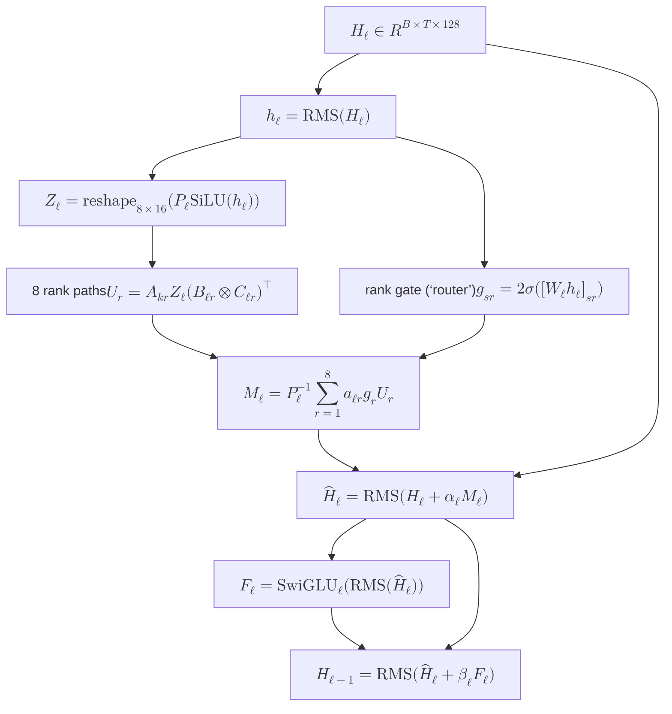

# Kronecker model

**Current frozen candidate:** `deep-kron-r8`
**Code:** [`exp13_wikitext_confirmation/model.py`](exp13_wikitext_confirmation/model.py), kept numerically identical to [`exp12_deep_kronecker/model.py`](exp12_deep_kronecker/model.py).

## Shape

| | Value |
|---|---:|
| Blocks | 32 |
| Width | 128 = 8 × 16 |
| Kronecker ranks | 8 |
| Shared causal banks | 4 |
| SwiGLU | 128 → 256 → 128 |
| Parameters | 6.41M total / 4.31M body |

Each block has two residual updates: a content-routed Kronecker mixer, then a
SwiGLU. The 32-block body therefore has 64 residual updates.

## One block

Repeat this block 32 times. Input and output use one tied vocabulary matrix.

The “router” is only a **rank gate**. At token $s$, it supplies eight scalars
$g_{s,1},\ldots,g_{s,8}$ controlling how much of each fixed rank path enters
$M$. It neither moves tokens nor generates a full weight matrix. Since
$W_{\mathrm{router}}=0$ initially, all gates start at $g=1$.

### The fixed channel layout $P_\ell$

$\ell$ is the block number, from 0 through 31. It is not a learned quantity.
For width 128, block $\ell$ constructs

$$
s_\ell=2\ell+1,\qquad
o_\ell=\frac{\ell(\ell+1)}{2}\bmod128,\qquad
P_\ell[j]=(s_\ell j+o_\ell)\bmod128.
$$

Every $s_\ell$ is odd and therefore coprime to $128=2^7$, so this formula
visits every channel exactly once: it is a permutation, not a projection or a
learned soft assignment. In code, `x[..., permutation]` forms
$y_j=x_{P_\ell[j]}$ and `argsort(permutation)` restores the original order.

$P_0$ is the identity; $P_1[j]=(3j+1)\bmod128$; and
$P_2[j]=(5j+3)\bmod128$. Its only job is to change which original channels
occupy the rows and columns of the $8\times16$ tensor in each block. Ignoring
the token operator and rank sum, the learned structured channel map is

$$
P_\ell^{-1}(B_{\ell r}\otimes C_{\ell r})P_\ell.
$$

The permutation alone does not mix information: if the operator inside were
the identity, $P_\ell^{-1}P_\ell=I$. It only changes the coordinate system in
which the learned Kronecker factors mix channels.

**Provenance.** The exact layer schedule above is a local Exp12 design; no
paper citation or tracked commit documents its introduction. The closest local
precursor is the same coprime affine-modular construction used for stateless
data shuffling in [`exp11_kronecker_debug/lm.py`](exp11_kronecker_debug/lm.py).
The broader design principle—shuffle between grouped/structured operators so
groups do not stay isolated—comes from
[*ShuffleNet*](https://arxiv.org/abs/1707.01083) and is structurally close to
the fixed permutations between block factors in
[*Monarch*](https://arxiv.org/abs/2204.00595). The repository already used the
latter pattern in
[`exp1_fullwidth_distill/qwen_fullwidth_distill/monarch.py`](exp1_fullwidth_distill/qwen_fullwidth_distill/monarch.py).

## Mixer math

For layer $\ell$ and rank $r$:

$$
D_{\ell r}=B_{\ell r}\otimes C_{\ell r},\qquad
B_{\ell r}\in\mathbb{R}^{8\times8},\quad
C_{\ell r}\in\mathbb{R}^{16\times16}.
$$

$A_{k(\ell),r}\in\mathbb{R}^{T\times T}$ is causal and row-normalized;
$k(\ell)=\ell\bmod4$. With $Z=\operatorname{reshape}(P_\ell\operatorname{SiLU}(\operatorname{RMS}(H)))$:

$$
U_{r,s,p,q}=\sum_{t\le s,i,j}
A_{k(\ell),r,s,t}\,B_{\ell r,p,i}\,C_{\ell r,q,j}\,Z_{t,i,j}.
$$

The token-local rank gate produces eight scalars—not a new matrix—for every
output token:

$$
g_{s,r}=2\sigma\!\left([W_{\mathrm{router}}\operatorname{RMS}(H)]_{s,r}\right),
\qquad
M=P_\ell^{-1}\operatorname{vec}\!\left(\sum_{r=1}^{8}a_{\ell r}g_r\odot U_r\right).
$$

The block updates are:

$$
\widehat H=\operatorname{RMS}(H+\alpha_\ell M),
\qquad
H'=\operatorname{RMS}(\widehat H+\beta_\ell\operatorname{SwiGLU}(\operatorname{RMS}(\widehat H))).
$$

$\alpha_\ell$ and $\beta_\ell$ initialize to $1/8$.

## What varies

- **Shared across layers:** four banks of causal token-mixing matrices, cycled
  through the stack; tied vocabulary matrix.
- **Different per layer:** $B$ and $C$ factors, router, rank amplitudes, fixed
  deterministic channel permutation, SwiGLU, and residual gains. The
  permutation is not learned.

## Evidence so far

- Exp12 validation: `1.558` lower mean NLL than its tuned matched Transformer.
- Throughput: `0.3952×` Transformer, just below the locked `0.4×` threshold.
- Exp13 is the frozen confirmation against tuned Transformer aspect ratios.

These are results for `deep-kron-r8`, not evidence for an untested variation.

## Next variation

Write the exact mathematical change here before changing the frozen model:

| Change | Why | Parameter/compute delta | Smallest falsification test | Status |
|---|---|---|---|---|
| Set $g_{s,r}=1$; retain fixed $P_\ell$ | Isolate whether content-dependent rank weighting helps | Remove 32,768 router parameters and its matmul | Retune LR for routed/unrouted models; matched data and seeds | proposed; not yet run |

When adopted, give the variation a new name and update this page, the diagram,
parameter accounting, implementation, and numerical tests together.

## Log

- **2026-08-03:** captured the frozen `deep-kron-r8` architecture.
