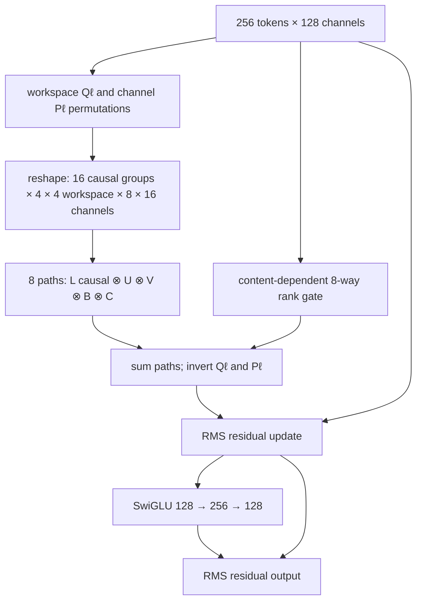
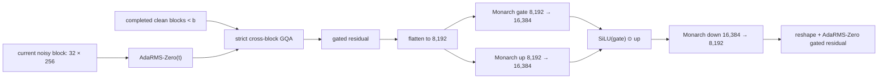

# Block-causal fully factorized Kronecker model

**Current experimental candidate:** `block-kron-r8`

**Code:** [`exp14_block_kronecker/model.py`](exp14_block_kronecker/model.py)

`deep-kron-r8` remains frozen in
[`exp13_wikitext_confirmation/model.py`](exp13_wikitext_confirmation/model.py).
Its Exp12/Exp13 evidence is historical evidence for a different architecture;
it is not silently relabeled as the candidate below.

## Key idea

The complete per-example state is retensorized as

$$
X\in\mathbb{R}^{
16_{\text{ordered groups}}
\times4_{\text{workspace 1}}
\times4_{\text{workspace 2}}
\times8_{\text{channel 1}}
\times16_{\text{channel 2}}}.
$$

This is 256 input tokens at width 128. Only the outer 16-group axis is
causal. The two inner token axes form a noncausal 16-token workspace: all
tokens in one group can exchange information before that group predicts the
next group.

For layer $\ell$ and rank path $r$, the structured whole-state map is

$$
L_{\ell r}\otimes U_{\ell r}\otimes V_{\ell r}
\otimes B_{\ell r}\otimes C_{\ell r},
$$

where

$$
L\in\mathbb{R}^{16\times16}\text{ is lower triangular},\quad
U,V\in\mathbb{R}^{4\times4},\quad
B\in\mathbb{R}^{8\times8},\quad
C\in\mathbb{R}^{16\times16}.
$$

$U,V,B,C$ are dense and noncausal. The model sums eight paths and applies a
content-dependent eight-way rank gate, as in the prior candidate.

## Why the loss shifts by one group

Ordinary one-token-shift training would leak labels: an output at workspace
slot $j$ can see every other source token in its own group, including token
$j+1$. Exp14 instead reconstructs 272 consecutive tokens and uses

$$
\text{input}=z_{0:256},\qquad \text{target}=z_{16:272}.
$$

Output group $g$ predicts target group $g+1$. Its lower-triangular outer
factor can access source groups $0,\ldots,g$, but never source group $g+1$.
The resulting factorization is

$$
p(z)=\prod_g\prod_{j=0}^{15}
p\!\left(z_{16(g+1)+j}\mid z_{<16(g+1)}\right).
$$

Predictions inside a target group are conditionally independent. This is a
block-autoregressive language model, not conventional token-autoregressive
likelihood. Every Transformer control therefore receives the same 16-token
shift and the same block-causal attention boundary. Conventional next-token
NLL must not be compared numerically to this block NLL.

The cached Exp10 rows are consecutive nonoverlapping 257-token chunks. Exp14
appends the first 15 tokens of row $i+1$ to row $i$, exactly reconstructing the
required 272-token stream without retokenizing or crossing a discontinuity.

## Workspace and channel permutations

Layer $\ell$ constructs two fixed affine-modular permutations:

- $Q_\ell$ permutes the 16 workspace slots independently inside every causal
  group before they are reshaped to $4\times4$.
- $P_\ell$ permutes the 128 channels before they are reshaped to $8\times16$.

Both are inverted after the rank paths. Composing layers therefore changes
which workspace slots and channels share a small Kronecker factor. No
permutation crosses a group boundary. The ordered outer groups cannot be
arbitrarily shuffled without violating causality.

The `block-kron-r8-no-workspace-permutation` ablation uses the identical model
and parameters with $Q_\ell=I$ in every layer.

## One block

There are 32 blocks and therefore 64 nonlinear residual updates.

## Size and scaling

| | Value |
|---|---:|
| Input tokens | 256 |
| Prediction shift | 16 tokens |
| Causal groups | 16 |
| Workspace per group | 4 × 4 = 16 tokens |
| Width | 8 × 16 = 128 |
| Blocks | 32 |
| Kronecker paths | 8 |
| Total parameters | 5,400,896 |
| Body parameters | 3,303,744 |
| All token-factor parameters | 43,008 |

The previous dense token banks used 1,052,672 learned token coefficients and
scaled as $O(RT^2)$. The new per-layer token factors use

$$
R\left(\frac{G(G+1)}2+W_1^2+W_2^2\right)
$$

parameters and sequential factor application costs
$O(RTD(G+W_1+W_2))$, before the channel factors. If the three token modes are
grown in balance, token parameters scale as $O(T^{2/3})$ and token mixing as
$O(T^{4/3})$, rather than $O(T^2)$. Holding the workspace fixed while growing
only $G$ would lose that advantage; scaling experiments must grow the modes
together.

## Matched experiment

Exp14 compares the candidate against four independently AdamW/Muon-tuned
block-causal Transformers spanning depth/width aspect ratios. Their total
parameter counts are within 0.1% of 5.401M. The paid pilot also measures:

- exact fused-loss agreement against materialized cross entropy;
- ambitious batch sweeps, VRAM, utilization, throughput, and eight-worker
  full-node scaling;
- four fresh paired final seeds after LR/optimizer/schedule selection;
- the fixed-recipe no-workspace-permutation ablation.

Paid results, including the corrective independent Muon/AdamW audit, are
recorded in [`exp14_block_kronecker/RUN_RESULTS.md`](exp14_block_kronecker/RUN_RESULTS.md).
The original small AdamW win did not survive optimizer-independent tuning:
the tuned Muon Transformer won all four fresh 40M-token seeds by `0.425456`
mean block NLL.

## Exp15: bidirectional rank routing

Exp14's so-called rank router is destination-only. For destination token
$s$, it chooses how much of each already-mixed path to receive:

$$
y_s=\sum_r q_r(x_s)[T_r C_r x]_s.
$$

The source content has no say in which path carries it. Exp15 adds an
independent source router before the structured token factors:

$$
y_s=\sum_r q_r(x_s)
\left[T_r\left(k_r(x)\odot C_r x\right)\right]_s.
$$

Here $k_r(x_t)$ is a key-like gate on source token $t$, $q_r(x_s)$ is a
query-like gate on destination token $s$, $C_r=B_r\otimes C_r$ mixes the
channels, and $T_r=L_r\otimes U_r\otimes V_r$ mixes token modes. Both routers
are token-local linear maps followed by $2\sigma(\cdot)$ and are zero
initialized, so every gate is exactly one at initialization. This isolates
the effect of learned routing without changing the initial operator.

Source routing does **not** create an attention matrix. Each source is gated
once and then passed through the same factorized block-causal operator. It
therefore preserves the no-$T^2$ design: the learned token parameters and
sequential factor-application complexity remain those in the size table
above. It also preserves block causality because the source gate depends only
on that source token and the outer factor remains lower triangular.

Exp15 screens eight mechanistic interventions concurrently on eight H100s:

| Variant | Question |
|---|---|
| `current-r8` | Reproduces the destination-only Exp14 mixer |
| `ffn-only` | Does structured token mixing help at all? |
| `source-r8` | Is sender-side routing sufficient? |
| `bi-r8` | Do independent sender and receiver gates help? |
| `decoupled-r8` | Does diagonal coupling of token/channel rank limit the model? |
| `bi-decoupled-r8` | Do bi-routing and independent rank sums complement one another? |
| `dense-workspace-r8` | Is the $4\otimes4$ workspace itself too restrictive? |
| `bi-r12` | Is the routed mixer simply rank limited? |

The decoupled variants compute an independent sum of $R$ channel paths and
an independent sum of $R$ token paths. Expanding the composition yields
$R^2$ effective token/channel pairings (64 at rank 8), while parameter storage
and factor application stay additive rather than allocating 64 full
Kronecker paths. The dense-workspace diagnostic replaces only
$U_r\otimes V_r$ with a dense $16\times16$ per-rank factor; it is a deliberate
local capacity probe, not the intended scalable endpoint.

The `ffn-only` control retains the inactive mixer parameters, so its parameter
count exactly matches `current-r8`. The screen is followed only on evidence:
a successor must materially beat `current-r8`, while the mixer must beat the
FFN-only control, before longer optimizer-tuned confirmation consumes paid
compute.

## Exp16: does the router learn and matter?

Exp15 showed that bi-routing did not improve 10M-token loss under a shared
AdamW recipe, but it did not measure whether the zero-initialized routers
learned nontrivial gates or whether those gates affected predictions. Exp16
turns that ambiguity into a causal diagnostic.

Five `bi-decoupled-r8` replicas share seed, data order, model initialization,
base LR, schedule, physical batch, and token budget. Only the router parameter
groups differ, with LR multipliers `0×`, `1×`, `3×`, `10×`, and `30×`. The
remaining GPUs run `current-r8`, `dense-workspace-r8`, and `bi-r8` controls.
All eight tracks run concurrently on the eight-H100 node.

For every track, Exp16 records:

- router, token-factor, channel-factor, and FFN gradient norms;
- source/destination gate mean, variance, range, and saturation by layer;
- router weight RMS and structured mixer-update/state RMS;
- absolute cosine similarity among rank paths at five depths;
- held-out block NLL with source, destination, or both routers forced back to
  zero weights, which restores the exact neutral all-one gates.

The best routed configuration advances to four paired 40M-token seeds only if
all three conditions hold at the 10M screen: at least `0.005` NLL improvement
over `current-r8`, at least `0.002` NLL degradation when its gates are forced
neutral, and mean source or destination gate standard deviation of at least
`0.02`. This distinguishes a router that merely changes numerically from one
that learns nontrivial assignments and causally improves the objective.

Exp16 stopped at this gate. The best `bi-decoupled-r8` router-LR intervention
improved over `current-r8` by only `0.000087` block NLL, and forcing its learned
source and destination gates back to neutral changed NLL by only `0.000014`.
Even the ordinary destination router changed NLL by just `0.000018` when
neutralized. The gates learned large, often saturated values but were not
causally useful. New candidates retain the routed model only as a frozen
control and spend their active parameter budget on groupwise nonlinearity.

## Exp17: nonlinear density over 16-token groups

The next hypothesis is narrower than “more mixing should help.” Exp14–16 may
have mixed token representations broadly while still applying nearly all
nonlinear expansion independently to each token. Exp17 moves the active SwiGLU
workspace from one token to a complete 16-token group. With
$X\in\mathbb{R}^{16\times D}$, one factored path computes

$$
H_r=\operatorname{silu}(A^g_r X (B^g_r)^\top)
    \odot(A^u_r X (B^u_r)^\top),\qquad
Y=\sum_r A^d_r H_r(B^d_r)^\top.
$$

The $A$ factors mix workspace positions and the $B$ factors mix channels. A
hidden unit therefore depends nonlinearly on the whole source group without a
dense matrix over the full sequence. Factors require a sum of mode products;
they do not allocate an attention matrix or a flattened sequence-wide MLP.
The outer mixer remains lower-triangular over groups and unrestricted inside a
group, so the model is block causal: group $g$ may use groups $0\ldots g$, and
the 16 positions inside group $g$ form a shared noncausal workspace.

```mermaid
flowchart LR
    ids["token IDs\nB × 256"] --> emb["shared vocabulary embedding\nB × 16 groups × 16 workspace × D"]

    subgraph layer["Exp17 GroupDensityLayer × depth"]
        direction LR
        x["layer state X"] --> norm["RMSNorm + SiLU"]
        norm --> perm["layerwise workspace/channel permutation"]
        perm --> chan["ranked channel factors\nC¹ᵣ ⊗ C²ᵣ"]
        chan --> work["noncausal workspace factors\nW¹ᵣ ⊗ W²ᵣ"]
        work --> outer["inclusive causal outer factor Lᵣ\nover the 16 groups"]
        outer --> rsum["Σᵣ αᵣ pathᵣ"]
        x --> mixres["mixer residual + RMSNorm"]
        rsum --> mixres

        mixres --> gnorm["joint group RMSNorm"]
        gnorm --> gate["Aᵍᵣ X Bᵍᵣᵀ"]
        gnorm --> up["Aᵘᵣ X Bᵘᵣᵀ"]
        gate --> swiglu["SiLU(gate) ⊙ up"]
        up --> swiglu
        swiglu --> down["Σᵣ Aᵈᵣ Hᵣ Bᵈᵣᵀ"]
        mixres --> ffnres["group-FFN residual + RMSNorm"]
        down --> ffnres
    end

    emb --> x
    ffnres --> logits["tied vocabulary projection\n16-token-shifted block logits"]
```

The diagram is the frozen `group-kron-r*` path. `dense-group` replaces only the
factored group SwiGLU with a literal flattened-group MLP; `no-router-token`
replaces it with a token-local SwiGLU; the matched Transformer is an external
control. None of these variants changes the inclusive block-causal boundary.

The 5.4M-parameter mechanism screen contains these independently tuned tracks:

| Track | Width/depth | Nonlinear operation | Parameters | Nonlinear sites/example |
|---|---:|---|---:|---:|
| `current-r8` | 128/32 | routed token SwiGLU | 5,400,896 | control |
| `no-router-token` | 128/32 | router-free token SwiGLU | 5,404,992 | 2,121,728 |
| `dense-group` | 128/32 | literal flattened-group SwiGLU | 5,400,896 | 8,192 |
| `group-kron-r1` | 128/32 | rank-1 factored group SwiGLU | 5,400,928 | 8,192,000 |
| `group-kron-r2` | 128/32 | rank-2 factored group SwiGLU | 5,400,960 | 7,929,856 |
| `group-kron-r4` | 128/32 | rank-4 factored group SwiGLU | 5,401,024 | 7,798,784 |
| `group-kron-hybrid` | 128/32 | token plus rank-1 group SwiGLU | 5,400,928 | 3,112,960 |
| `group-kron-deep` | 80/64 | deeper rank-1 group SwiGLU | 5,399,232 | 16,534,528 |
| `block-transformer-d3-w256` | 256/3 | Transformer control | 5,397,760 | control |

The literal dense-group model is a capacity control, not the scalable proposal.
The rank, hybrid, and deep variants ask whether rank diversity, retention of a
token-local path, or trading width for depth and nonlinear fan-out is most
useful. All counts differ from the 5,400,896 reference by less than 0.1%; FLOPs
and throughput are logged but are not silently substituted for parameter
matching.

Every one of the nine tracks receives its own five-cell AdamW LR sweep and a
4-by-3 Muon body/auxiliary LR grid. Boundary winners extend the grid. The two
best recipes per optimizer family then cross constant versus warmup-cosine
schedules on two fresh seeds at 5 tokens/parameter. A candidate advances only
if it beats the strongest KronMix control by at least `0.02` block NLL and
disabling its group-nonlinear branch worsens NLL by at least `0.01`. The final
stage uses four paired fresh seeds and 20 tokens/parameter against both KronMix
and the matched Transformer; every seed must win, the mean margin must be at
least `0.02`, and both paired 95% upper bounds must be below zero.

Paid preflight compiles the hidden path, checks BF16 fused-loss agreement,
finite forward/backward/optimizer state, and sweeps per-model physical batches
from 1,048,576 down to 102,400 global tokens/step. It accepts only at least 85%
GPU utilization and verifies eight-worker scaling on all eight H100s. Training
uses no gradient accumulation and records actual examples/tokens per step,
throughput, utilization, and peak allocated/reserved VRAM.

### Evidence status (live 2026-08-04)

The first paid preflight is a failed infrastructure audit, not an architecture
result. All nine tracks passed exact-loss agreement, but the run stopped before
tuning when a static leading-batch guard exceeded TorchDynamo's eight-entry
recompile limit. The corrected identity keeps sequence/model shapes static and
compiles only the leading batch dimension symbolically. Failed audit:
[`yafo20sa`](https://wandb.ai/lev-tear-tear-labs/exp17-group-density/runs/yafo20sa).

The corrective eight-H100 preflight passed under
[`zdmkehl2`](https://wandb.ai/lev-tear-tear-labs/exp17-group-density/runs/zdmkehl2):

| Track | Selected contexts/step | Tokens/step | Throughput | Median GPU util. | Peak allocated |
|---|---:|---:|---:|---:|---:|
| `current-r8` | 640 | 163,840 | 109,905 tok/s | 100% | 73.9 GiB |
| `no-router-token` | 4,096 | 1,048,576 | 99,771 tok/s | 100% | 31.9 GiB |
| `dense-group` | 4,096 | 1,048,576 | 100,683 tok/s | 100% | 31.9 GiB |
| `group-kron-r1` | 4,096 | 1,048,576 | 90,536 tok/s | 100% | 41.1 GiB |
| `group-kron-r2` | 4,096 | 1,048,576 | 79,298 tok/s | 100% | 43.1 GiB |
| `group-kron-r4` | 4,096 | 1,048,576 | 76,069 tok/s | 100% | 47.3 GiB |
| `group-kron-hybrid` | 4,096 | 1,048,576 | 96,142 tok/s | 100% | 36.1 GiB |
| `group-kron-deep` | 4,096 | 1,048,576 | 58,734 tok/s | 100% | 39.8 GiB |
| `block-transformer-d3-w256` | 4,096 | 1,048,576 | 2,400,957 tok/s | 99.5% | 36.4 GiB |

All tracks use one physical batch and zero gradient accumulation. Relative
BF16 fused-loss versus FP32 materialized-loss errors were `0.00000616` to
`0.00005666`; measured eight-worker cell scaling efficiency was `0.9981`.
Throughput is recorded as an important practical cost, not used as the matching
criterion: the screen remains matched by total parameters.

Coarse 2-token-per-parameter tuning is complete. The following are single-seed,
independently tuned minima, including the first live LR boundary extensions,
and **must not be reported as replicated final comparisons**:

| Coarse track | Best block NLL | Delta vs. `current-r8` |
|---|---:|---:|
| `block-transformer-d3-w256` | **7.370125** | -0.014154 |
| `current-r8` | 7.384280 | — |
| `group-kron-deep` | 7.422289 | +0.038010 |
| `no-router-token` | 7.433064 | +0.048784 |
| `group-kron-r1` | 7.436661 | +0.052382 |
| `group-kron-hybrid` | 7.437781 | +0.053501 |
| `group-kron-r2` | 7.442674 | +0.058395 |
| `group-kron-r4` | 7.443547 | +0.059267 |
| `dense-group` | 7.536244 | +0.151965 |

This is not a super-clear win; it is currently a loss. The Transformer has the
best coarse NLL. Depth helped the group family, but it did not close the gap.
At a fixed parameter budget, raising group rank makes each path narrower:
rank 1 uses a `64×250` hidden factor, rank 2 uses two `64×121` paths, and rank 4
uses four `68×56` paths. The observed rank-1/2/4 ordering says the extra paths
do not compensate for lost per-path width in this regime. The replicated
schedule/seed stage subsequently made the loss decisive: the Transformer
reached `7.155114`, current KronMix `7.376960`, and group rank 1 `7.380991`.
Rank 1 was `+0.004031` worse than current and `+0.225876` worse than the
Transformer. Its nonlinear branch was active—turning it off worsened NLL by
`0.542544`—but it did not learn a superior solution. Exp17 therefore stopped at
the mechanism gate without a longer final.

After a real mechanism win, context grows through 256, 512, and 1,024 tokens at
5M parameters while comparing dense, dilated causal-prefix, and causal Toeplitz
outer factors. The prefix factor costs $O(G\log G)$ parameters and has global
causal reach; Toeplitz costs $O(G)$. Scaling then proceeds to 25M/512,
100M/1,024, and 256M/2,048. Only 5M and 25M are automatically authorized. A
shared two-layer causal decoder inside each predicted group is required before
FineWeb-Edu or standard next-token likelihood claims, because the first-stage
16-token-shifted block objective is a diagnostic objective rather than ordinary
autoregressive perplexity.

Learning-rate boundaries are adaptive rather than one-shot. If the best AdamW
body, Muon body, or Muon auxiliary rate is still on an observed edge, Exp17
doubles (or halves) that edge again for up to four rounds. Explicit caps are
`0.192` AdamW, `1.92` Muon body, and `0.096` Muon auxiliary; a non-finite edge
cell is recorded as the end of that direction rather than crashing the rest of
the campaign.

## Exp18: memorize before generalizing

Exp17's corpus loss combines three questions: can the architecture represent
the mapping, can the optimizer find it, and does the learned mapping generalize?
Exp18 follows the small-data debugging ladder and separates the first two
before another generalization claim.

Eight matched 5.4M tracks—the Transformer, current rank-8 model, router-free
token model, rank-1/2/4 group models, hybrid, and deep group model—first train
on exactly one fixed 256-token block. Each receives four AdamW and four Muon
recipes, with no weight decay and LR boundaries extending through `0.048`
AdamW and `0.96/0.096` Muon body/auxiliary rates. The best stable recipe from
each optimizer family then trains on exactly two fixed blocks at two fresh
initialization seeds.

Memorization requires exact teacher-forced token accuracy of `1.0` and NLL at
most `0.01`; NLL at most `0.001` is reported separately. Complete curves retain
steps and wall time to NLL `1`, `0.1`, `0.01`, `0.001`, and perfect accuracy. A
Transformer pass with a group-Kronecker failure is an architecture or gradient-
path bug, not a generalization result. If the group model passes, the selected
recipe proceeds through 8, 32, and 128 examples before returning to corpus
training.

The cloud batch repeats the same one or two examples to occupy the H100s.
Reports therefore distinguish physical tokens from unique information: for
example, 4,096 repeated contexts are 1,048,576 physical tokens but still only
256 unique training tokens in the one-example stage. This prevents hardware
utilization from being mistaken for dataset scale.

### Completed Exp18 evidence: why rank 1 remains the default

All 64 one-sample cells and all 32 two-sample confirmation cells completed.
Every promoted architecture/optimizer pair memorizes both fixed blocks at both
fresh seeds. With independently selected optimizers, rank 1, rank 2, and the
deep group model all reach exact token accuracy and NLL at most `0.01` in a
mean of six optimizer steps. Current rank 8 needs eight steps, the router-free
token model twelve, and the matched Transformer thirteen. Rank 1 therefore has
a real interpolation-step advantage over the Transformer, but it is tied with
rank 2 and deep rather than a unique architecture win.

The selected rank-1 recipe changes from the one-sample cell with the lowest
stopped NLL to AdamW `0.048` after two-seed confirmation: it hits at step 6 in
both seeds. Rank-1 Muon `0.24/0.048` takes steps 8 and 6. Rank 2 AdamW also hits
at step 6 in both seeds and records the lowest stopped-run mean NLL, `0.001935`,
versus rank 1 `0.003430`. These NLLs are not fixed-budget endpoints because
cells stop after confirming the `0.01` success gate.

Rank 1 remains the next group default because it combines the tied fastest
interpolation tier with the best replicated full-data group NLL (`7.380991`
versus rank-4 `7.381523` and rank-2 `7.382181`), aggressive-LR stability, the
fewest paths, and higher measured throughput (90,139 tok/s versus 79,544 and
76,026 tok/s). The matched-budget mechanism remains important: rank 1 has one
broad `64×250` hidden path, rank 2 divides the budget across two `64×121`
paths, and rank 4 uses four `68×56` paths. Higher rank is not required for
two-example expressivity.

This is an interpolation diagnostic, not a generalization win. Exp17's tuned
Transformer still leads rank 1 `7.155114` to `7.380991` on replicated WikiText
validation, and the Transformer preflight is 26.7 times faster than rank 1.
The next evidence gate is 8, 32, and 128 unique examples with held-out
evaluation and architecture-specific optimizer tuning. Complete results and
raw-artifact locations are in
[`exp18_memorization/RUN_RESULTS.md`](exp18_memorization/RUN_RESULTS.md).

## Exp19: residual and RMSNorm repair

The Exp17/18 result does not cleanly test group density because the candidate
and Transformer use materially different residual conditioning. Each rank-1
layer currently computes

$$
x' = \operatorname{RMS}(x + aM(x)),\qquad
x'' = \operatorname{RMS}(x' + bF(x')),
$$

so disabling both branches does not recover the identity. The depth-32 model
crosses 64 such post-residual normalizations plus its final normalization,
whereas the depth-3 Transformer crosses only three post-FFN normalizations.
The numerical RMS reduction is FP32 and finite, but it has no learned affine
gain and is not placed on an identity-preserving pre-norm path.

Saved H100 telemetry confirms the practical failure. The best rank-1 replicas'
group-hidden variance falls from `5.66` to `0.00106` and from `20.89` to
`0.00641` between the first and last captured layers. At the same time their
nonlinear updates remain as large as `1.41` to `2.54` times the state RMS.
Some rank-2 middle layers reach more than `80×`; deep rank-1 final layers fall
below `0.05×`. Post-normalization hides this mixture of branch domination and
collapse.

Exp19 therefore freezes the legacy model and introduces cumulative ablations:
pre-norm topology alone; learned affine RMSNorm; removal of redundant scale
gauges with fixed $1/\sqrt{2L}$ residual scaling; tokenwise versus joint-group
normalization; a corrected token-FFN control; and corrected width/depth-matched
and wide/shallow Transformers. The primary corrected form is

$$
x' = x + \alpha M(\operatorname{RMSNorm}_1(x)),\qquad
x'' = x' + \beta F(\operatorname{RMSNorm}_2(x')),
$$

followed by one final learned RMSNorm. Factor contractions, target alignment,
and block causality already match explicit references; Exp19 changes the
conditioning shell, not the core block-causal Kronecker definition.

The paid preflight now requires eager/checkpointed/compiled gradient and
optimizer-step parity in addition to exact loss. Layer telemetry records
state/update RMS, residual cosine, hidden variance and participation, scale
parameters, factor spectra, radial/tangent factor updates, gradient imbalance,
and position-level NLL. A million-token physical batch no longer excuses a
26-update experiment: corpus evidence is gated behind the small-data ladder
and requires at least 128 optimizer updates before selection and at least 256
for fresh-seed confirmation. The live specification is in
[`exp19_norm_residual/README.md`](exp19_norm_residual/README.md).

The first recovered eight-H100 preflight showed that a per-branch lower bound
is not depth invariant. Under the fixed $1/\sqrt{2L}$ residual scale, the
depth-3 and depth-32 Transformers have almost identical aggregate initialized
branch-energy RSS (`0.08213` and `0.08238`) even though individual deep branches
are smaller. Exp19 therefore gates finite ratios, individual maximum `0.5`, and
aggregate RSS `[0.05,0.75]`; the old `[0.02,0.20]` fraction remains telemetry.
The clean joint/token candidates pass with aggregate RSS about `0.553` and no
initial variance collapse. The two retained-scale diagnostic variants reach
RSS `2.05`, maximum ratio `0.831`, and uniquely fail compiled-gradient and
optimizer-delta parity, so they remain audited but are not trained or promoted.
The six valid tracks run through a dynamic eight-GPU queue, and short preflight
stages schedule duplicate filler cells rather than leaving paid GPUs idle.

## Exp20 cached outer and mixer-throughput isolation

Exp20 freezes Exp19 as evidence and splits the structured mixer at the causal
outer boundary. The exact dense cache stores each completed 16-token group's
ranked, permuted pre-outer representation. A new group computes only its inner
channel/workspace transform and contracts the next lower-triangular row against
that history. This is an exact blockwise inference cache; it does not change or
accelerate the full-sequence training graph.

The implementation comparison retains the dense outer and tests the original
multi-input factorized contraction against fixed-shape compilation and
rank-batched GEMMs at mixer ranks 1, 2, 4, and 8. Rank-dependent group-hidden
widths retain the 5.4M total-parameter match. The rank-1 group-density FFN is
unchanged: this is explicitly a structured-mixer-rank sweep.

A separately named order-three semiseparable outer maintains three recurrent
feature states and an exact 3-by-3 row-norm Gram state per mixer rank. Its
materialized matrix, full scan, and streaming step share parameters and must
pass forward/backward parity. It is an architecture candidate, not an
implementation rewrite of the dense lower triangle.

The eight-H100 campaign profiles all eight execution cells in parallel,
searches downward from a million-token physical batch, measures exact-cache
latency and memory at batches 1/8/64, and stops before learning if packed rank
eight does not double the contemporaneous dynamic-reference throughput. Only
a passing backend receives independently tuned AdamW/Muon one- and two-example
screens; the campaign always stops before corpus work. The live specification
is in [`exp20_outer_cache/README.md`](exp20_outer_cache/README.md).

## Implemented V2-SBD-97M-DreamR32-v1: simpler block diffusion

**Evidence status:** implemented, eight-H100 preflight-complete, and the paired
25M-target-token learning-rate screen plus independent 100M confirmation are
complete. The confirmation converged in grouped KL but failed teacher top-1
and greedy-generation promotion gates; long-run promotion is rejected for the
frozen `0.8 KL + 0.2 CE` recipe. This does not replace the current
Kronecker candidate or inherit evidence from Exp14--20. The compiled real-corpus hot-load proof used 448
contexts and about 463k target tokens per step, reached about 39.2k target
tokens/s, and reduced fixed held-out grouped KL by 1.68% in 925k target tokens.
The compiled batch-64 compute benchmark subsequently established 512 contexts,
about 543k target tokens per step, 41.6k target tokens/s, and 94.8% mean GPU
utilization as the full-node screen configuration. These are early systems and
learning-path checks, not a promotion-quality result.

This candidate distills the frozen `Dream-org/DreamReasoner-8B` revision
`ed62b1d2c82ccd234b05ed2463b4c0ee640f2068` online into a 32-token
block-diffusion student. The sequence is causal between completed blocks, but
there is no same-block attention. A single dense-in-the-block Monarch-SwiGLU
map mixes the flattened 32-token by 256-channel workspace.

For block $b$, cross-block attention is strictly

$$
A_b=\operatorname{GQA}(Q(H_b),K(H^{clean}_{<b}),V(H^{clean}_{<b})),
$$

so the current and future blocks never provide attention keys or values. For
$X_b\in\mathbb{R}^{32\times256}$, let $x_b=\operatorname{vec}(X_b)$ have
width 8,192. The local branch is

$$
M(x_b)=M_{down}\left(
\operatorname{SiLU}(M_{gate}(x_b))\odot M_{up}(x_b)
\right),
$$

where gate/up map $8192\rightarrow16384$, down maps
$16384\rightarrow8192$, and every map is a rank-1, 128-block Monarch matrix.
There is no separate token FFN. Each residual branch uses AdaRMSNorm-Zero,
conditioned on the block mask fraction $t_b=m_b/32$, with zero-initialized
residual gates.

The frozen configuration is width 256, depth 11, four query heads, two KV
heads, head width 64, context 2,048, block size 32, RoPE base $10^6$, tied
151,936-by-256 embeddings, and BF16 execution. Its exact parameter count is:

| Component | Parameters |
|---|---:|
| Tied token embedding/output | 38,895,616 |
| 11 layer bodies at 5,310,080 | 58,410,880 |
| Shared mask-rate MLP | 525,568 |
| Final RMSNorm | 256 |
| **Total** | **97,832,320** |

Compared with DreamReasoner, the intended mechanism removes same-block
quadratic attention and replaces it with a structured but globally connected
block map, while retaining causal prefix retrieval. The principal compute
risk is not the student but the colocated 8B online teacher and its vocabulary
projection. Teacher logits are therefore gathered only at masked positions
and reduced in vocabulary chunks to exact top-16-plus-tail targets; full
`[batch,4096,151936]` logits are forbidden.

The smallest falsification test is a fixed tiny corpus on which (1) gradients
prove that block $b$ cannot depend on current/future blocks through attention,
(2) the packed teacher mask matches naive block-by-block logits, and (3) the
student reduces grouped distillation KL by at least 90%. Full details and all
promotion gates live in `v2__simpler_block_diffusion/SPEC.md`.

### V2 optimization protocol and evidence

The four specified peak learning rates were tested on independent
25M-target-token runs. A 100M-token warmup would never reach a candidate peak
inside such a screen, so the screen-only schedule used a 2M-target-token linear
warmup followed by cosine decay through 25M. Each run evaluated
the same immutable held-out cache every 5M target tokens and compare grouped KL,
hard NLL, fully masked metrics, update/gradient health, and loss AUC. Each run
uses compiled eight-way DDP at 64 physical contexts/GPU (512 globally), without
gradient accumulation, using the audited duplicate-free 32,768-context cache.

This schedule delta changed no model parameter or forward compute. All four
runs were finite, hot-loaded the compiled graph, held about 95% mean GPU
utilization, and finished in about 642 seconds. Fixed held-out results were:

| Peak LR | Final grouped KL | Reduction | Final hard NLL | Normalized KL AUC |
|---:|---:|---:|---:|---:|
| `1e-4` | 2.70216 | 14.41% | 11.08605 | 2.81305 |
| `3e-4` | 2.04618 | 35.19% | 9.53325 | 2.39644 |
| `6e-4` | 1.34115 | 57.52% | 8.16463 | 1.89869 |
| **`1e-3`** | **1.04975** | **66.75%** | **7.74562** | **1.53986** |

The `1e-3` candidate won at every paired milestone and by both final KL and
loss AUC, so it is selected for the staged 100M-target-token confirmation with
a 10M-token warmup. This selection freezes the optimizer candidate, not a
quality promotion: the 100M run must still pass the existing agreement and
generation gates. If it does, the unchanged 10B schedule uses the specified
100M-token warmup.

### Staged corrective objective experiment (not current architecture)

The completed 100M run exposed a loss/generation mismatch: held-out grouped KL
fell from `3.15725` to `0.95336` (69.80%), yet overall teacher top-1 was
`18.51%` and all 128 greedy completions were degenerate. Temperature `0.8`,
top-p `0.95` removed mechanical repetition in 127/128 samples but remained
linguistically incoherent. The exact top-16-plus-single-tail objective controls
the total student tail mass but intentionally cannot identify how probability
is distributed among its roughly 151k tail tokens; the 20% clean-token CE was
insufficient after 100M target tokens.

Stage a recipe-only corrective continuation named `V2-SBD-v1-CE80-r1`. It
does not alter the 97,832,320 parameters, forward graph, block causality,
Monarch operators, AdaRMSNorm conditioning, data, teacher, or full-node compute.
Starting from the immutable 100M checkpoint, change only

$$
0.8\,\mathrm{KL}_{top16+tail}+0.2\,\mathrm{CE}_{clean}
\quad\longrightarrow\quad
0.2\,\mathrm{KL}_{top16+tail}+0.8\,\mathrm{CE}_{clean}.
$$

The intended mechanism is to constrain individual vocabulary identities while
retaining online Dream distribution guidance. The loss has the same streamed
vocabulary passes and therefore no material parameter, activation-memory, or
teacher-compute increase. The smallest falsification test is a 50M-target-token
continuation to 150M total with identical cached data/RNG continuation and
eight-way compiled batch 64. It must remain finite, improve fixed fully-masked
hard NLL by at least 5% from `7.67888`, and improve the 128-prompt greedy
non-degenerate rate above the observed `0%`. It is a corrective experiment,
not evidence for the frozen recipe unless those measurements pass.

After that proposal was staged, the requested end target was sharpened to a
useful 100M-parameter model with measured small-model benchmark parity, with
permission to replace per-step distillation by pretraining/SFT. The one-step
CE80 numerical preflight was finite, but no 50M CE80 run is launched. It is
superseded by the more compute-efficient staged recipe
`V2-SBD-v1-CE100-pretrain-r1`:

$$
\mathcal L_{train}=\mathrm{CE}(x_0,q),
$$

using the same block corruption and group-balanced averaging. Dream remains
frozen and is loaded only to construct immutable held-out KL/top-1 metrics; it
is then released before optimizer steps. This changes no student parameter or
forward operator. It removes the teacher's measured 91.6% share of steady step
time and its resident training memory, while replacing approximate grouped-tail
guidance with token-identified supervision. The expected effect is materially
higher throughput and better token modes; the risk is loss of teacher soft
structure and a temporary increase in grouped KL.

Before a learning launch, sweep teacher-free physical batches downward from a
global target batch near one million tokens and record throughput, VRAM, and
all-rank utilization. The smallest quality falsification is a 25M-new-token
continuation from the immutable 100M checkpoint: fixed fully-masked hard NLL
must improve and greedy generations must improve beyond 0/128. A longer
pretraining/SFT campaign is authorized only from those measured results.

The continuation schedule is measured in **new CE target tokens**, independently
of the absolute checkpoint counter.  If the immutable checkpoint contains
$T_0$ target tokens, the scheduler consumes $T-T_0$, warms up over 2M new target
tokens, and cosine-decays against the declared 25M-new-token diagnostic horizon.
The optimizer moments remain those of the immutable checkpoint for this smallest
test, but every parameter group's LR is reset from the continuation schedule
before the first CE optimizer step.  This is a training-control change only: it
adds no parameters or forward compute.  Its intended mechanism is to avoid an
accidental near-floor LR caused by interpreting the short diagnostic stop as the
entire historical schedule.  The smallest falsification test is deterministic
unit coverage at the schedule origin/warmup/end plus the finite 25M continuation;
the schedule origin and horizon must be present in checkpoint/result metadata.

The batch sweep also exposed host synchronization in the audit path: the model,
gradient, and every Adam tensor were scanned with a separate Python truth-value
synchronization after every update, while three scalar metrics and CUDA timing
were globally synchronized every update even when W&B logging was deferred.
The staged `CE100-throughput-audit-r1` control change keeps the same math and
optimizer, but performs the full finite model/gradient/optimizer audit on the
first update, every logging update, and the final preflight update; scalar
metric reductions and timing synchronization occur only when logged. Finite
checks aggregate device predicates before one host synchronization. This adds
no parameter or compute-graph change. The falsification test is loss/counter
agreement against the current path plus a 21-step, log-every-10 all-rank run;
it must stay finite and materially close the measured kernel-to-wall-time gap.

## Implemented fresh successor mechanics: V2-SBD-FKL-Muon-r1

The grouped-tail and CE continuations above are completed negative evidence;
none of their student or optimizer state initializes this successor.  The new
candidate keeps the causal cross-block attention, 32-token dense Monarch
workspace, tied vocabulary, and AdaRMSNorm-Zero mechanism, but selects one new
90--120M configuration through an output-rank oracle:

| width | layers | exact parameters |
|---:|---:|---:|
| 256 | 11 | 97,832,320 |
| 288 | 9 | 104,656,608 |
| 320 | 7 | 107,085,696 |
| 384 | 5 | 119,011,456 |

For a candidate width $d$, a randomized SVD of the frozen Dream output matrix
$W_T\approx U_dS_dV_d^\top$ initializes the tied vocabulary
$E=U_dS_d^{1/2}$ and a temporary teacher projector
$A=V_dS_d^{1/2}$.  Exact-KL refinement of $(E,A)$ on a calibration split is an
output-rank oracle, not student evidence.  Select the smallest width whose
oracle reaches at most `0.10` exact KL on both fixed aggregate corruptions and
fully masked blocks.  If none does, select the lowest oracle at or below
`0.20` with a low-margin warning; if all exceed `0.20`, the requested target is
falsified inside the allowed size range before body training.

For every supervised position and every vocabulary entry except the mask ID,
the new primary loss is the exact temperature-one forward KL

$$
\mathcal L_{FKL}=\sum_{v\ne [MASK]}p_T(v\mid s)
  \left[\log p_T(v\mid s)-\log p_S(v\mid s)\right].
$$

No top-k or grouped tail enters this number.  A custom function streams teacher
and student vocabulary chunks, uses stable running normalizers and teacher
moments, and recomputes chunks for the student backward; full logits and full
probability tables are never retained.  Training samples at most 256 masked
positions per context, stratified across blocks, while held-out evaluation
uses every eligible position and reports aggregate and fully masked KL,
student/teacher hard NLL, and top-1 agreement.

Every Monarch `factor1` and `factor2` matrix at each rank/block slice receives
an independent canonical Muon update.  Other body matrices receive ordinary
matrix Muon; the tied vocabulary, norms, and biases use AdamW.  Muon uses
momentum `0.95`, Nesterov, five Newton--Schulz iterations, and zero factor
weight decay.  The body/auxiliary LR screen is staged before the long launch.

The tied oracle vocabulary first remains frozen for 10M targets while the body
learns `full_KL + 0.1 * projected_hidden_cosine`; the hidden auxiliary is then
removed and the vocabulary is unfrozen for pure exact-KL training.  After the
fixed held-out KL reaches `1.0`, DAgger-style on-policy state distillation is
introduced: the student executes a random prefix of its actual eight-step,
four-tokens-per-step block decoder, and Dream labels the remaining masks in
that student-generated state with the same exact full KL.  The state mixture
is 100% fixed above KL 1.0, 50/50 fixed/on-policy from 1.0 to 0.5, and
20/80 below 0.5.  Only one teacher query is made per sampled trajectory.

The CE-entry checkpoint must report exact full KL at most `0.20` for aggregate
fixed corruptions, fully masked blocks, and on-policy states under three frozen
evaluation seeds.  Hard NLL is monitored but is not a handoff gate.  The
adaptive budget is 4B supervised targets, with immutable milestones at 25M,
100M, 250M, 500M, 1B, 2B, and 4B.  Two consecutive milestones improving both
fixed slices by less than `0.02` absolute and 2% relative declare a plateau.
After a passing checkpoint, the expected CE objective is `0.9 CE + 0.1 FKL`,
implemented as CE every step and one live exact-KL anchor every tenth step.

The exact streamed objective, factor-sliced Muon routing, randomized-SVD head
oracle, projected-hidden warm start, and shared eight-step DAgger/decode commit
rule are implemented and locally covered. This is implementation status, not
quality evidence. The first full-node systems sweep found eager batch 88 OOM
and eager batch 80 stable. Compiled batch 80 completed three finite updates at
163,636 supervised targets/update, 10,628 targets/s, 93.33% mean utilization,
and 54.03/58.33 GiB peak allocated/reserved memory. Its random-head KL near
`5.56` is a pipeline baseline only; the head oracle and fresh quality run remain
the evidence gate.

## Log

- **2026-08-06:** implemented and unit-validated the fresh successor's exact
  full-vocabulary forward KL, independent final-two-axis Muon updates for every
  Monarch slice, tied-head randomized-SVD oracle, frozen-head hidden warm start,
  and the common four-token commit primitive used by eight-step inference and
  DAgger rollouts. A real-cache eight-H100 compiled preflight passed three
  finite steps at batch 80; no convergence claim is attached to it.

- **2026-08-06:** implemented V2-SBD-97M-DreamR32-v1, exact streamed
  top-16-plus-tail distillation, AdaRMSNorm-Zero, Monarch block mixers,
  eight-way DDP, revision-resolved direct corpus streaming, and persistent
  per-rank token caches. The largest stable physical batch was 56 contexts/GPU
  (batch 64 OOM), and the real-cache preflight passed five finite steps at
  471,883 target tokens/step and 95.38% mean utilization. No quality or
  convergence claim is attached to this preflight.

- **2026-08-06:** proved compiled-artifact hot loading, fixed held-out
  evaluation, checkpoint/resume continuity, and an early 1.68% grouped-KL
  reduction in 925k target tokens. A corrected compiled sweep found batch 64
  stable and marginally faster than batch 56 at about 41.6k target tokens/s,
  while increasing the global target batch to about 543k. Staged the four-way
  25M-token learning-rate screen protocol above; no screen result is yet
  attached to the architecture.

- **2026-08-06:** completed four paired 25M-target-token screens on all eight
  H100s. Peak LR `1e-3` won every held-out milestone, reducing grouped KL from
  `3.15725` to `1.04975` (66.75%) with normalized KL AUC `1.53986`, while all
  runs retained about 95% mean utilization and about 40--41k target tokens/s.
  Selected it for the still-unproven 100M confirmation.

- **2026-08-06:** completed the independent compiled 100M confirmation at
  100,133,258 target tokens in 2,531 seconds. Fixed grouped KL reached
  `0.95336` (69.80% reduction) but top-1 agreement was only `18.51%` and the
  fixed greedy gate produced 0/128 non-degenerate completions. A sampled
  diagnostic removed repetition but produced incoherent text. Rejected 10B
  promotion for the frozen `0.8 KL + 0.2 CE` recipe and staged the exact CE80
  corrective experiment above before implementation.

- **2026-08-03:** replaced the un-factorized dense token bank in the live
  candidate with an explicitly block-causal, fully factorized token workspace.
- **2026-08-03:** made the one-group target shift and conditional-independence
  tradeoff explicit; preserved `deep-kron-r8` as the frozen prior candidate.
- **2026-08-04:** independently tuned AdamW and the joint Muon
  body/auxiliary-LR grid for the candidate and locked Transformer. The
  candidate retained a `-0.007284` AdamW-only mean delta, but tuned Muon gave
  a decisive `+0.425456` candidate-minus-Transformer delta at 40M tokens.
- **2026-08-04:** specified Exp15's source-before-mix and
  destination-after-mix bi-router, plus source-only, FFN-only, rank-decoupled,
  dense-workspace, and rank-12 diagnostics. Rank 16 was rejected at preflight
  because it could not fit the 102,400-token physical-batch floor without
  accumulation. The operator remains block causal
  and does not instantiate a quadratic token interaction.
- **2026-08-04:** completed the eight-H100 Exp15 screen. All selected preflight
  cells reached 99–100% utilization after moving corpus gathers onto GPU, with
  `0.9832` full-node scaling efficiency. `bi-decoupled-r8` was the best
  successor at 10M tokens but improved by only `0.000464` block NLL; the
  evidence gate stopped before optimizer tuning and long confirmation.
- **2026-08-04:** specified Exp16's router-specific LR intervention, per-layer
  gate/gradient/path telemetry, and evaluation-time forced-neutral causal
  ablations. Longer confirmation remains evidence-gated.
- **2026-08-04:** completed Exp16 on eight H100s. Router LR changed and often
  saturated the gates, but the best loss win was `0.000087` and the best
  forced-neutral effect was `0.000014`; the campaign stopped before tuning or
  confirmation with verdict `stop_router_not_causally_useful`.
- **2026-08-04:** implemented Exp17's router-free 16-token nonlinear workspace,
  literal dense and rank/depth/hybrid controls, causal-prefix and Toeplitz outer
  factors, local causal decoder, independent AdamW/Muon tuning campaign, strong
  paired gates, and full-node cloud preflight.
- **2026-08-04:** Exp17's first paid preflight passed exact loss on all nine
  tracks but stopped before training when a static batch guard exhausted
  TorchDynamo's recompile cache during the ambitious batch sweep. Changed the
  compiled hidden path to a symbolic batch dimension; sequence/model shapes
  remain fixed.
- **2026-08-04:** corrective Exp17 preflight passed on eight H100s with all
  selected tracks at 99.5–100% warmed utilization, at least 163,840 tokens per
  optimizer step, and `0.9981` measured eight-worker cell scaling. Recorded the
  live incomplete coarse-grid minima separately from any result claim.
- **2026-08-04:** completed the Exp17 coarse screen without an architecture
  win: the matched Transformer led at `7.370125`, while group rank 1/2/4 reached
  `7.436661`, `7.442674`, and `7.443547`. Added the cloud-only Exp18 one/two-
  example memorization ladder to debug expressivity and optimization before
  spending more compute on generalization.
- **2026-08-04:** completed all Exp17 robust tuning. The tuned Transformer won
  at `7.155114`; current KronMix and group rank 1 reached `7.376960` and
  `7.380991`. The group branch passed its causal-ablation gate but rank 1 failed
  the required win by `0.024031`, so the campaign stopped before long final or
  scaling stages.
- **2026-08-04:** launched Exp18 on eight H100s. In the 60/64-cell one-sample
  snapshot, rank 1 reached the memorization gate in six steps across a broad LR
  range and remained the best full-data group variant. Logged rank 1 as the
  current default while explicitly retaining the pending two-sample/two-seed
  confirmation gate.
- **2026-08-05:** completed Exp18. All 16 promoted architecture/optimizer pairs
  memorized both blocks at both fresh seeds. Rank 1, rank 2, and deep tied at
  six optimizer steps; the independently selected Transformer needed thirteen.
  Retained rank 1 as the simplest tied default, documented that this is not a
  generalization win, and advanced the next gate to 8/32/128 unique examples
  with held-out evaluation.
- **2026-08-05:** audited Exp17's normalization with an independent reviewer.
  Found no contraction, causality, or target bug, but identified an unmatched
  deep post-norm residual path, missing learned RMS gain, redundant scale
  gauges, severe layerwise hidden-variance collapse, and an inadequate
  26-update corpus horizon. Began Exp19 to isolate and repair these issues with
  gradient-parity launch gates and full conditioning telemetry.
- **2026-08-05:** recovered the first complete Exp19 eight-H100 preflight and
  its direct W&B run. Confirmed healthy clean pre-norm initialization, replaced
  the invalid architecture-independent branch lower bound with aggregate
  energy gating, retained redundant-gauge parity failures as audit evidence,
  excluded those two tracks from compiled promotion, and added W&B layer tables
  plus complete preflight artifacts before relaunch.
- **2026-08-05:** the corrected Exp19 preflight passed at 1,048,576 tokens per
  step with all eight workers at 99.5–100% utilization. Clean Kron memorized one
  block in 8 evaluated steps versus 24 for the best Transformers, but remained
  9.9–25x slower per step and retained only 6–8% of raw normalized-factor
  optimizer displacement. Northflank replaced the instance during replicated
  confirmation; recorded the run as crashed without claiming later results,
  paused the replacement, and hardened the launcher with persistent attempt
  control, stale-heartbeat recovery, and verified scientific-state resume.
- **2026-08-05:** tested the first resume and found that Northflank `/cache`
  was instance-ephemeral too. Stopped the duplicate preflight, recovered the
  complete screen from 356 immutable W&B rows, bound it and the passed preflight
  into a SHA-256 resume manifest, added portable stage snapshots, and changed
  replacement recovery to restore the external bundle rather than assume node
  storage persists.
- **2026-08-05:** resumed Exp19 from the verified bundle and completed all 36
  two-example confirmation cells. Clean joint/token required means of 8.0/9.33
  evaluated steps, versus 16.0 for token-FFN and 24.0 for both Transformers.
  Confirmed healthy clean residual branches but only 6.7–8.0% effective factor
  displacement; promoted replicated optimizer winners into the active
  8/32/128-example held-out ladder without claiming a compute/generalization
  win.
