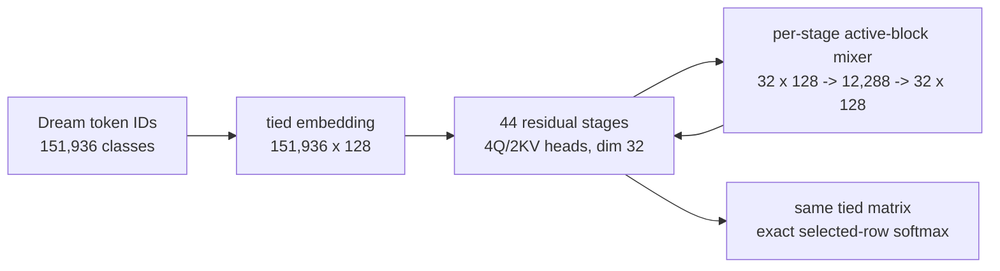
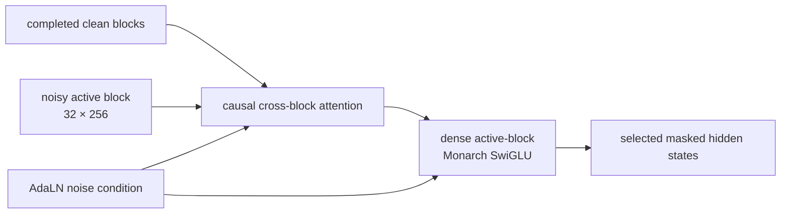

# V3 dLLM Monarch student

**Candidate:** `V3-DLLM-MONARCH-96M-deep-v2.3-dolci-think`

**Status:** the deep-v2.3 data, exact-loss, eight-H100 finite-state, throughput,
and two-consecutive-heldout-improvement gates pass under
[`dn4qr9nh`](https://wandb.ai/lev-tear-tear-labs/v3-dllm-monarch/runs/dn4qr9nh).
A fresh finite 640-update quality run targeting about 100M supervised tokens is
active under
[`luq2o8tl`](https://wandb.ai/lev-tear-tear-labs/v3-dllm-monarch/runs/luq2o8tl).
The deep-v2.2 finite step-100 continuation completed under
[`tk3utbpe`](https://wandb.ai/lev-tear-tear-labs/v3-dllm-monarch/runs/tk3utbpe).
The completed deep-v2.1 quality proof is immutable under
[`f9061fos`](https://wandb.ai/lev-tear-tear-labs/v3-dllm-monarch/runs/f9061fos).
The earlier 44-layer run under
[`furcfgms`](https://wandb.ai/lev-tear-tear-labs/v3-dllm-monarch/runs/furcfgms)
completed, but its raw FineWeb-Edu corpus is outside the requested experiment.
It remains immutable systems and optimization evidence only; it is not
post-training quality evidence and its held-out metrics are not the baseline
for this candidate.

The completed width-256/depth-11 predecessor remains immutable evidence under
`V3-DLLM-MONARCH-97M-v1.2`; no result attached to it is reinterpreted as deep-v2.

## Proposed loss-normalization candidate: deep-v2.4

`V3-DLLM-MONARCH-96M-deep-v2.4-global-kl` is proposed as a checkpoint-640
continuation of deep-v2.3. It changes no model parameter, attention mask,
corruption distribution, dataset, teacher, tokenizer, optimizer routing, or
per-token KL mathematics. Completed deep-v2.3 evidence remains immutable.

The delta is the distributed reduction. Deep-v2.3 minimizes an equal-rank
average of rank-local selected-token means,

$$
L_{2.3}=\frac1R\sum_{r=1}^{R}\frac1{n_r}\sum_{i=1}^{n_r}
D_{\mathrm{KL}}(P_{T,r,i}\Vert P_{S,r,i}),
$$

although the audited `eval/full_kl` metric weights every selected token
equally. Random corruption gives ranks different $n_r$. In addition, deep-v2.3
declares an oversized per-device evaluation batch of 104 for a 128-context
holdout; Accelerate correctly dispatches 16 contexts/rank, but Trainer repeats
each rank scalar 104 times and truncates the gathered 832 entries to 128. Those
two reductions made native `eval_loss` end at `2.64854` while canonical
token-weighted heldout KL ended at `3.12029`. Deep-v2.4 declares the actual
16-context per-rank evaluation batch, returns per-token values from the
memory-bounded exact-KL function, and uses

$$
L_{2.4}=\frac1{\sum_r n_r}\sum_{r=1}^{R}\sum_{i=1}^{n_r}
D_{\mathrm{KL}}(P_{T,r,i}\Vert P_{S,r,i}).
$$

Each rank backpropagates $R\sum_i KL_{r,i}/\sum_r n_r$, so DDP's gradient
average is exactly the gradient of $L_{2.4}$. The same per-token values become
the sole production source for training KL and heldout full KL. The separate
materialized projection remains only for CE, accuracy, agreement, confidence,
entropy, and a tiny test oracle.

Parameter effect is zero: the student remains 95,572,992 parameters. The
per-row FP32 KL vector is negligible beside the selected hidden states, so the
expected compute and memory effect is negligible. The smallest falsification
test is an uneven-rank partition whose distributed loss and gradients equal a
single materialized global reference, followed by one BF16 eight-H100 update
where `eval_loss` and `eval/full_kl` agree and throughput remains at least
25,000 selected tokens/s.

If that gate passes, three separate checkpoint-640 continuations will compare
proportional Muon/AdamW learning-rate scales `1.00x`, `1.25x`, and `1.50x` for
60 updates each. This is an offline-KD optimization screen, not on-policy or
pseudo-trajectory training. A winning stable arm must improve canonical
heldout KL by at least 0.02 before receiving 100M additional supervised tokens.

## Implemented data-scale candidate: deep-v2.3

The proposed identity is
`V3-DLLM-MONARCH-96M-deep-v2.3-dolci-think`. It changes no model parameter,
visibility rule, corruption rule, optimizer route, or exact forward-KL math.
It replaces the throughput candidate's small, reasoning-stripped data cache
with pinned `allenai/Dolci-Think-SFT-32B` revision
`7668c638cc84100951973b456069a1a462d6d915`. This is the 2,253,684-row,
156-shard SFT mixture used for OLMo 3 32B Think SFT. Every assistant answer
contains a reasoning trace. Its source mixture includes 941,164
OpenThoughts 3 examples, 113,777 Nemotron post-training code examples,
220,530 Nemotron-persona instruction examples, 104,548 verified SYNTHETIC-2
examples, 466,676 Python examples, and smaller instruction, chat, safety, and
multilingual sources. This is late-2025 post-training data; it is not raw web
or pretraining text.

For an ASAP first materialization, the deterministic packed training cache is
capped at 4,000,000 512-token contexts: 2,048,000,000 processed tokens before
corruption, over 23 times the deep-v2.2 cache. All 16 observed source labels are
eligible and their observed counts are audited; the cap is a storage/time
boundary, not source filtering. The fixed heldout split remains a disjoint
hash of conversation IDs before packing. Dream's pinned chat template and
final-assistant-content supervision remain unchanged.

Training gains a hard epoch-budget gate. An epoch request must satisfy
$0 < E \le 10$. A step-budget request computes

$$
E_{\mathrm{planned}} =
\frac{S\,B_{\mathrm{device}}\,N_{\mathrm{GPU}}\,G}{N_{\mathrm{contexts}}},
$$

where $S$ is the total optimizer-step limit and $G$ is gradient accumulation,
and rejects the launch if $E_{\mathrm{planned}}>10$. The requested and
calculated epoch budgets, global contexts/update, and processed-token budget
must be written to W&B and the result/audit JSON. For scale: at the retained
b104 x 8 physical batch, 4,000,000 contexts are about 4,808 updates per epoch;
the existing 100M supervised-token target is expected to be far below one
epoch, not repeated tiny-data cycling.

The intended mechanism is both better teacher-domain alignment and enough
unique reasoning supervision that a token-budgeted run does not revisit the
same small cache. Parameter effect is zero (95,572,992 trainable parameters).
The first falsification test is: exact dataset revision and 156-shard
provenance pass; all examples are chat-shaped post-training rows; source,
train/heldout-ID, token, and eligibility digests are recorded; at least two
billion packed tokens materialize; the b104/c2048 eight-H100 update remains
finite and above 100,000 selected tokens/update; and two consecutive fixed
heldout KL improvements occur. Only after this candidate passes may a separate
Nemotron-v3 multi-domain ingestion candidate be proposed; its many schemas and
access terms are deliberately not hidden inside this simple data change.

The data portion of that gate passes. All 156 pinned shards downloaded and
hashed. Exactly 2,231,429 training conversation IDs and 22,255 heldout-bucket
IDs are disjoint. The cache contains 4,000,000 contexts and 2,048,000,000 raw
tokens; 2,011,080,353 tokens (98.1973%) are eligible final-assistant content.
The fixed 128-context holdout is 98.2681% eligible. Training token and
eligibility digests are respectively
`a739250d125370acbc20eceb13a723d84459976583f9b453e5a20a48e7d65cd5`
and
`a0ef0608eb28f5d8b1cdd10571a6db7367f8d5bdda43ea12c1746ec67e00dd89`.
The eight-H100 finite-state and throughput portions also pass at physical
b104/GPU, eight-way data parallel, and accumulation 1. The global update is
832 contexts and 425,984 processed tokens. Two hot updates selected 156,389
and 158,721 supervised tokens in 5.354 and 5.285 seconds (29,209 and 30,035
supervised tokens/s). Peak allocated/reserved VRAM is 75.27/75.58 GiB;
run-wide mean utilization including startup and per-step evaluation is 78.25%,
and every rank's median is 100%. The fixed holdout improved KL on three
consecutive updates from 9.99963 at initialization to 9.89068, 9.79113, and
9.73536; student CE improved from 11.95241 to 11.68382 while frozen-teacher CE
remained 5.69055. Checkpoint 3 was written. This promotes deep-v2.3 to current.
The active quality proof uses the same b104 configuration for 640 updates,
272,629,760 planned processed tokens and 0.13312 planned epoch, with fixed
heldout evaluation and full-state checkpointing every 20 updates.
Its first scheduled evidence point passes: after 3,172,317 supervised tokens
at step 20 (0.00416 epoch), heldout full KL improved from 9.99963 to 8.73972
and student CE from 11.95241 to 10.68481 while teacher CE remained 5.69055.
Checkpoint 20 is complete, the run is continuing, and a simultaneous live
sample showed 100% utilization on all eight GPUs.

## Implemented throughput candidate: deep-v2.2

This proposal does not reinterpret deep-v2.1 evidence and changes no student
parameter, visibility rule, optimizer route, or forward-KL distribution. It
stages three throughput changes behind a new experiment identity.

First, one profiled update records synchronized all-rank wall time for frozen
teacher forward, student forward, exact-KL forward, total backward/DDP, and
optimizer step. Profiling is off outside explicit preflights and has zero
parameter effect.

Second, replace the FLAN-dominated Tulu cache with pinned
`allenai/Dolci-Instruct-SFT` revision
`bd3c8f3a9b2cc5a9682e44b96ddd0bb2ff027221`, filtered to `OpenThoughts3`,
`Tulu 3 Persona`, and `CoCoNot` row sources. FLAN and every other source remain
excluded. Dream chat rendering and final-assistant-content eligibility are
unchanged. The intended mechanism is a higher response-token fraction and
longer useful targets per fixed 512-token context. The materialized response
fraction and source counts must be measured before any paid launch. The first
cache is capped deterministically at 262,144 packed contexts (134,217,728 raw
tokens) so the throughput experiment does not require preprocessing the entire
2.15M-row mixture; this is a data-volume cap, not a batch or loss change.
The audited materialization reached 167,971 contexts (86,001,152 raw tokens)
before heterogeneous per-shard quotas exhausted; 64,940,897 tokens, or 75.51%,
are eligible assistant content. The fixed 128-context holdout is 73.76%
eligible. Allowed source counts are 99,268 OpenThoughts3 Science, 254,936 Tulu
3 Persona, and 10,957 CoCoNot conversations. Train/holdout ID and token/eligibility
digests are recorded in the manifests.

Third, partition the 151,935 non-mask vocabulary rows into fixed chunks
$C_1,\ldots,C_K$. The exact loss remains

$$
\mathrm{KL}(P_T\Vert P_S)=
\sum_k\sum_{v\in C_k}p_T(v)
\left[(\ell^T_v-\log Z_T)-(\ell^S_v-\log Z_S)\right],
$$

with $\log Z_T$ and $\log Z_S$ accumulated by an online max/rescaled-sum
reduction across chunks. Teacher chunks run without gradients. One small autograd function
recomputes each chunk during backward and returns the analytical
$P_S-P_T$ student-logit gradient rather than retaining a float32
`selected_rows x vocabulary` buffer. Peak projection storage falls from
$O(RV)$ to $O(RC)$ for selected rows $R$, vocabulary $V$, and chunk width $C$;
student and teacher vocabulary-projection compute increases because of
backward recomputation. This custom exact-KL backward is now justified by
measured b104 OOM in Liger's 2.6--3.6 GiB float32 accumulator; it is deliberately
limited to the exact KL rather than becoming a general streamed-kernel layer.
The first $C=8192$ preflight reached KL at physical b108 but OOMed on a
0.52--0.54 GiB per-rank exponential allocation with only about 0.5 GiB free.
The staged retry therefore uses $C=2048$, one quarter of that chunk workspace;
the loss is mathematically identical. Physical batch is not reduced until this
smaller exact chunk is falsified.

The initially staged fixed-shape 44-layer student-stack compile was falsified:
eight rank processes spent 15 minutes lowering at b108 without producing a
cache artifact or reaching one optimizer update. It is not part of the current
candidate. The narrower maintained PyTorch FlexAttention attempt was also
falsified after eight minutes of lowering without a cache artifact or update.
The selected implementation therefore remains eager PyTorch SDPA; dense
bidirectional Monarch mixing inside each active block is untouched. Selected-row
gathering, teacher work, diagnostics, and chunked KL are eager as well.
The exact optimization KL is logged every update. The redundant second
full-vocabulary projection over training rows is disabled for v2.2 because the
fixed heldout cadence already logs full KL, student/teacher CE, and top-1
metrics; this removes diagnostic compute only and changes no gradient.

The smallest falsification gate is: chunked loss and student gradients agree
with a materialized tiny-vocabulary reference; BF16 full-vocabulary loss is
finite; the profiler accounts for an update without changing loss; the new
data has disjoint ID/digest audits and materially higher assistant eligibility;
the post-change physical-batch sweep records OOM boundaries, VRAM, utilization,
and throughput; and fixed-heldout KL improves twice. Promotion requires at
least 15,000 selected tokens/s, with 25,000 as the target. If exact online KL
still dominates below that floor, offline frozen-teacher targets become a
separate phase-two recipe proposal rather than a silent change to v2.2.

The measured baseline profile at b96 x 8 x 4 assigned 15.27 s mean to four
teacher forwards, 7.72 s to Liger KL forward, 3.23 s to student forward,
2.44 s to backward/DDP, and 0.15 s to the optimizer. The v2.2 sweep then found
b112 OOM in the student, b108/c8192 OOM in KL, and b108/c2048 finite once but
not multi-step stable after persistent optimizer state allocation. The retained
configuration is physical b104/GPU, eight-way data parallel, accumulation 1:
832 global contexts and 425,984 processed tokens/update. Two hot updates
selected 134,239 and 137,897 supervised tokens in 5.295 and 5.315 seconds,
respectively (25,354 and 25,947 supervised tokens/s). Peak allocated/reserved
VRAM was 75.16/75.48 GiB; run-wide mean utilization including startup and the
synchronized profile was 75.82%, and every rank's median while sampled was
100%. This passes the 25k throughput goal. The fresh fixed holdout then improved
full KL monotonically from 10.68438 at initialization to 9.97478 at step 10;
student CE improved from 11.96064 to 11.25520 while teacher CE remained exactly
6.58970. Checkpoint 3 restored under the same W&B run and checkpoints 5 and 10
were written. The resumed leg measured 85.23% run-wide mean utilization,
100% minimum-rank median, and 75.10/75.42 GiB peak allocated/reserved VRAM.
This passes the two-consecutive-improvement and resume gates. The finite
evaluation/checkpoint-every-10 continuation completed at step 100, exactly
0.50 epoch over the 167,971-context cache and 13,348,512 supervised tokens.
Held-out full KL improved monotonically from 10.68438 to 5.66716 and student CE
from 11.96064 to 6.95046; frozen-teacher CE remained 6.58970. The final hot
update selected 132,874 tokens in 5.284 seconds (25,148 selected tokens/s), and
checkpoint 100 is retained.

## Implemented post-training-only correction: deep-v2.1

The model and loss mathematics are unchanged from deep-v2.0. The exact data
delta is

$$
\text{raw FineWeb documents, all tokens}
\quad\longrightarrow\quad
\text{pinned Tulu 3 conversations, assistant-response tokens only}.
$$

Only the manifest-approved Tulu sources `oasst1_converted`, `coconot`,
`flan_v2_converted`, `persona_math`, `persona_gsm`, `persona_python`,
`persona_algebra`, and `persona_if` are eligible. WildChat, No Robots, raw web,
and every unlisted source are excluded. Conversations are rendered with the
pinned Dream repository's `chat_template.jinja`, packed into 512-token
contexts, and carry an explicit eligibility bit per token. BD3 corruption and
the selected-position forward KL may choose only assistant-response bits;
prompt, system, padding, and separator tokens cannot contribute targets.
Training and the fixed 128-context holdout use a deterministic split of
conversation IDs before packing and record disjoint ID/token digests. A
physical-shard split is deliberately not used because Tulu groups originating
datasets by shard and its final shard contains none of the manifest-approved
sources.

The intended mechanism is distribution alignment: DreamReasoner is evaluated
on the assistant continuations it was built to answer, rather than arbitrary
raw-web locations. Parameter effect is zero: the candidate remains width 128,
44 layers, and exactly 95,572,992 trainable parameters. Attention/Monarch
compute per physical context is unchanged; selected-row KL work and selected
tokens per physical batch may fall with the assistant-token fraction. If one
maximum-memory physical batch does not reach 100,000 global selected tokens,
the minimum necessary gradient accumulation is permitted and must be reported.

The smallest falsification gate is: the pinned template digest is recorded;
every row source is on the allowlist; prompt tokens are never corrupted or
scored; train/holdout conversation IDs and token digests are disjoint; all contexts
are 512 tokens; the materialized tiny-reference KL still agrees; a finite BF16
eight-H100 update passes; initial teacher CE and accuracy are measured on the
new fixed holdout; and two consecutive held-out KL improvements occur before
this proposal becomes current quality evidence.

The materialized training cache passes the data portion of that gate: 106,990
train conversation IDs produce 54,554 packed contexts and 27,931,648 raw
tokens. Exactly 5,145,336 tokens (18.42%) are assistant-response eligible. The
fixed 128-context holdout contains 19,970 eligible response tokens. The actual
matched sources are 89,982 FLAN-v2-converted, 10,983 CoCoNot, and 7,131
OASST1 conversations; all other physical Tulu rows are excluded. All six
staged Parquet SHA-256 values, the train/heldout ID digests, token digest,
eligibility digest, and pinned Dream template digest
`639b8dbd0ae92bdf5267b69d54a7a79026cf395cebac7a0af04c9b463d8d5a65`
are recorded in the cache manifests.

The post-training physical-batch sweep found batch 112/GPU OOM in the Monarch
activation stack and batch 104/GPU OOM in Liger's exact-vocabulary KL
allocation. Batch 96/GPU with four gradient-accumulation passes is finite at
74.03 GiB peak allocated: 3,072 global contexts and 136,442 selected response
tokens in the measured update, 35.79 seconds/update, 3,812 selected tokens/s,
and 80.91% run-wide mean utilization (100% minimum-rank median while active).
Accumulation is necessary because one maximum-memory physical microbatch has
only about 34k selected response tokens.

The fresh fixed-holdout baseline is full KL 9.35919, student CE 11.96686,
teacher CE 6.01161, teacher hard-token top-1 23.99%, and teacher entropy
2.59852. Steps 1, 2, and 3 improved full KL consecutively to 9.27838, 9.19818,
and 9.14629; student CE reached 11.74944 while the frozen-teacher metrics
remained bit-stable. This passes the two-consecutive-improvement gate. Full
model/composite-optimizer/scheduler/eight-rank-RNG checkpoints 1/2/3 were
written, and checkpoint 3 restored under the same W&B run for a finite step-100
continuation with evaluation/checkpointing every ten updates. It completed with
13,545,964 supervised tokens. Held-out full KL improved monotonically from
9.35919 at initialization to 6.04330 at step 100; student CE improved from
11.96686 to 8.59209 while teacher CE remained 6.01161. Checkpoints 80, 90, and
100 are retained.

## V1.2 exact Dream teacher correction

V1.2 retains pinned dLLM commit
`ca176752fbceec49c6b4777a2c18ae88e4eb10ed` and its Transformers 4.57 stack for
BD3 corruption, dataset/collation APIs, Trainer/DDP, checkpointing, evaluation, and
Dream support. The reproducible bootstrap makes two checkpoint-required fixes
to dLLM's copied `DreamModel`: Q/K/V projections honor
`attention_bias=false`, and each attention layer applies the checkpoint's
learned 128-wide Q/K RMSNorm vectors. The unmodified copy otherwise created 108
random bias tensors and discarded 72 checkpoint Q/K norm tensors.

dLLM's generation wrapper crashes when Transformers returns
`(model, loading_info)`, so the frozen teacher adapter invokes the maintained
`PreTrainedModel.from_pretrained` implementation directly with dLLM's
`DreamModel` class. Generation config is irrelevant to the training-only frozen
teacher. Startup requires zero missing, unexpected, mismatched, and errored
weights. The audited teacher has 8,190,735,360 frozen BF16 parameters.

V1.2 preserves V1.1's right-shifted selected-hidden projection and logical
block-boundary mask. Student parameters, optimizer routes, loss math, and token
batch are unchanged. Eight-H100 preflight run
[`mb5ekj68`](https://wandb.ai/lev-tear-tear-labs/v3-dllm-monarch/runs/mb5ekj68)
recorded nominal held-out KL `8.7604 -> 8.6308` and student CE
`11.9701 -> 11.8399` after one finite 203,984-supervised-token update. Teacher
CE was 5.7186 with 18.95% hard-token top-1 accuracy and remained identical
between evaluations. These old streaming-eval values remain historical logs,
but they are no longer accepted as fixed held-out evidence.

Fresh quality run
[`9th8eddp`](https://wandb.ai/lev-tear-tear-labs/v3-dllm-monarch/runs/9th8eddp)
improved nominal streaming-eval KL from 8.7698 at initialization to 5.0760 at
step 50.
Student CE improved 11.9805 to 8.2244, hard-token accuracy reached 4.46%, and
teacher top-1 agreement reached 9.16%. Its full
model/composite-optimizer/scheduler/eight-rank-RNG checkpoints were restored
under the same W&B run; an immutable milestone copy of `checkpoint-50` is
retained. The nominal teacher values were CE 5.7186 and hard-token top-1 18.95%.
Reconstructing that iterable at the step-50 continuation produced only 16
reported examples and changed full KL/teacher CE, proving that it was not a
valid fixed longitudinal set. Those metrics cannot establish Phase-C held-out
success; the disjoint materialized set below replaces them.

The completed step-300 run remains valid optimization and systems evidence. After an
unintended TorchInductor path exhausted eight shape recompilations, updates
entered true eager fallback: updates 59--110 took about 6.9--9.4 seconds for
roughly 175k--223k selected tokens, and a live steady-state trace measured all
eight H100s at 99--100% SM activity. Update 110 delivered 222,840 selected
tokens in 7.37 seconds. Exact training KL continued downward into the low-3
range with finite gradients. The run completed normally with 59,036,280
cumulative selected tokens and full checkpoint 300.

The completed step-10 resume measured 64.49 GiB peak allocated VRAM. Worker
ranks 1--7 averaged 95.50--95.89% GPU utilization, but rank 0 averaged 21.12%
because the every-step held-out evaluation creates a rank-0 coordination stall.
This is a measured systems defect, not accepted full-node throughput evidence.
The next resume honors its explicitly requested evaluation cadence instead of
restoring the short proof's eval-every-step cadence from `trainer_state.json`.

A boundary-triggered `nvidia-smi dmon` trace isolates the behavior: rank 0
lagged for roughly two one-second samples immediately after evaluation while
ranks 1--7 waited, after which all eight devices sustained 96--100% SM
utilization together throughout the optimizer update. Thus DDP training is
genuinely eight-way; reducing evaluation frequency removes the dominant
coordination overhead without changing the physical batch.

## Proposed systems optimization (no mathematical change)

The V1.2 attention math remains strict prior-block cross-attention. Its eager
implementation currently uses PyTorch efficient SDPA because FlashAttention
rejects the required non-null block mask. A maintained PyTorch FlexAttention
implementation of the identical mask is proposed for compiled training only;
generation retains the padding-aware SDPA path. On the exact per-rank training
shape, a one-H100 forward microbenchmark measured `0.8634 ms` for efficient
SDPA and `0.2342 ms` for FlexAttention (`3.69x` attention-kernel speedup), with
BF16 maximum absolute output difference `0.00390625`. This is not yet an
end-to-end throughput claim. The falsification gate is finite forward/backward,
loss agreement, and higher measured selected-token throughput in an eight-H100
preflight.

Separately, the next resume proposes no loss change but removes two telemetry
taxes: held-out evaluation moves from every update to every ten updates, and
full-vocabulary hard CE/top-1 diagnostics move to every five training updates.
The exact fused forward KL remains logged every update. Evaluation uses one
physical shard batch and 512-row diagnostic projection chunks instead of the
old 8-context batch cap and 128-row chunks.

The tested static selected-row padding path is rejected. Source inspection of
Liger 0.8.1 shows that this fused JSD implementation is not Inductor-specialized
on the selected row count; it chunks projections but allocates a full float32
`selected_rows × vocabulary` accumulator. Padding to
`physical_batch × 256` therefore increased memory and projection work without
preventing compilation. Padded/unpadded loss and gradients agree, but current
training correctly passes only real selected rows.

### Proposed fixed held-out split and worker correction

The current streaming held-out path is rejected for longitudinal evidence.
Measured at the step-50 resume, Hugging Face/Accelerate reported only 16
evaluated examples from the nominal 128-context iterable after distributed
sharding, and reconstructing the shuffled iterable changed full KL from the
prior step-50 value. Its eight persistent workers per rank also left 64
`pt_data_worker` processes alive; each inherited the node's large PyTorch CPU
thread pool while independently filling a 10,000-document shuffle buffer.
This starved training dispatch and produced staggered, low-duty-cycle GPU work.

The proposed systems/data-split correction materializes exactly 128 tokenized
contexts from pinned FineWeb-Edu source shard
`data/CC-MAIN-2013-20/train-00001-of-00014.parquet`, while training remains on
the existing disjoint `...00000-of-00014.parquet` Arrow cache. The maintained
Hugging Face streaming Parquet reader and dLLM tokenizer/grouping function
produce the held-out rows once; a content digest and both source revisions are
recorded before they are loaded as a map-style dataset. First-time preparation
uses the maintained Hub download and non-streaming Parquet reader; an initial
streaming implementation wrote the correct cache but hit an upstream fsspec/
PyArrow interpreter-shutdown crash, so it is not retained. Evaluation uses zero
subprocess workers because 128 fixed Arrow rows need no streaming prefetch.
Corruption, the exact KL, model, optimizer, and physical training batch do not
change.

The falsification gate is: exactly 128 unique held-out contexts, a recorded
split digest, bitwise-stable token IDs across loader reconstruction, identical
teacher metrics on repeated evaluation, no persistent `pt_data_worker`
processes, a finite resumed update, and higher measured all-rank GPU duty cycle.
The first evaluation on this new set establishes a new baseline; older
streaming-eval values remain labeled as invalid longitudinal evidence. The
post-aggregation full KL, student/teacher CE, agreement, accuracy, entropy,
noise, step, and cumulative supervised-token values are explicitly emitted to
W&B; returning them from `Trainer.evaluate()` alone is insufficient because
the base Trainer logs before the custom aggregation is appended.

An earlier 160-context/GPU streaming preflight was input-starved at 59--61
seconds/update and 30.01% mean GPU utilization. The current implementation now
constructs maintained `PreTrainedTokenizerFast` from the pinned Dream
`tokenizer.json`; exact IDs match Dream's reference tokenizer across the
focused Unicode/special-token audit. Dream vocabulary, normalization, EOS
insertion, and model math are unchanged.

Training now uses dLLM's maintained preprocessing function over pinned
FineWeb-Edu Parquet shard `...00000-of-00014.parquet`, persisted by Hugging Face
Datasets as 414,195 real 512-token Arrow contexts (212,067,840 raw tokens). The
manifest records source/dataset/tokenizer/dLLM revisions and a content digest.
Accelerate still dispatches one 1,280-context global batch into 160 contexts per
rank, but both Arrow-backed loaders use zero subprocess workers. This removes
the earlier 64-process streaming-worker fanout without a custom data engine.

The current run initially appeared slow because the compile-argument bug above
forced repeated whole-model compilation, not because Arrow starved it. Once
Dynamo fell back to eager, the cached data path sustained 6.9--7.5-second hot
updates and 99--100% SM activity on all eight H100s. The old streaming holdout
was the remaining source of 100+ second network pauses; it is replaced by the
disjoint 128-row local cache in the next process. Parameter count, attention,
corruption, exact KL, optimizer, and global physical batch are unchanged.

## Current deep/narrow candidate: `V3-DLLM-MONARCH-96M-deep-v2.0`

This is a new architecture identity, not a mutation or reinterpretation of the
completed V1.2 results. It halves the residual and tied vocabulary
width from 256 to 128, quadruples depth from 11 to 44 layers, changes each
query head from 64 to 32 dimensions while retaining four query and two KV
heads, and raises the flattened Monarch SwiGLU expansion from 2 to 3. The
32-token block size, rank-1 Monarch factors, block-causal/dense-within-block
visibility, tied Dream vocabulary, AdaLN-Zero conditioning, exact selected-row
forward KL, and optimizer routing rules are unchanged.

The exact mathematical delta is

$$
d:256\to128,\qquad L:11\to44,\qquad
(H_q,H_{kv},d_h):(4,2,64)\to(4,2,32),\qquad e_M:2\to3.
$$

For vocabulary size $V=151{,}936$, block size $B_s=32$, and 128 Monarch
blocks, the tied vocabulary table falls from $V\times256=38{,}895{,}616$ to
$V\times128=19{,}447{,}808$ parameters. A layer's three rank-1 Monarch maps
contain

$$
3(1+e_M)\frac{(B_s d)^2}{128}
=3(1+3)\frac{4096^2}{128}=1{,}572{,}864
$$

parameters. Across 44 layers this is 69,206,016 parameters. Attention,
Q/K norms, and AdaLN contain 148,288 parameters per layer, or 6,524,672 total.
The unchanged 256-to-1024 noise embedding MLP projected down to width 128 has
394,368 parameters, and final RMSNorm has 128. The audited exact total is

| component | parameters |
|---|---:|
| tied Dream vocabulary embedding/unembedding, $151{,}936\times128$ | 19,447,808 |
| 44 rank-1 Monarch SwiGLU blocks, expansion 3 | 69,206,016 |
| 44 attention + Q/K norm + AdaLN blocks | 6,524,672 |
| noise conditioner | 394,368 |
| final RMSNorm | 128 |
| **total** | **95,572,992** |

The intended mechanism is substantially more iterative refinement and a less
dominant vocabulary table: depth grows 4x, the vocabulary projection is 2x
cheaper per selected row, and Monarch parameters grow 33.3%. The principal
risk is that width 128 becomes an information bottleneck; 44 sequential layers
also increase launch/critical-path latency even though aggregate dense
attention parameters remain approximately constant.

The exact parameter/optimizer audit and finite BF16 tests pass. Earlier
161--200-second trials remain invalid throughput evidence because non-null
backend/mode fields silently enabled TorchInductor and triggered shape
recompilation. The corrected launcher supplies those fields only with an
explicit `--compile` and asserts the resulting TrainingArguments state.

The true-eager eight-H100 sweep tested physical batches downward without
accumulation. Batches 160, 144, 128, 112, and 96 exhausted the H100's 79.18 GiB
during the 44-layer activation stack. Batch 80 passed at 640 global contexts,
128,408--132,016 selected targets/update in its three-step preflight,
20,933 selected targets/s on the last hot update, and 71.69 GiB peak allocated.
Batch 64 was slower at 19,852 selected targets/s and sometimes fell below
100,000 selected targets/update, so batch 80 is the highest-throughput stable
configuration. Both passing trials serialized `torch_compile=false`.

The fresh fixed-holdout proof then improved full KL
`8.47427 -> 8.11967 -> 7.86257` at steps 0, 5, and 10. Student CE improved
`11.95449 -> 11.58747 -> 11.33059`, while frozen-teacher CE was bit-stable at
`5.87777`. Full checkpoints were written at steps 5 and 10. The step-10
model/composite-optimizer/scheduler/eight-rank-RNG state resumed under the same
W&B run. Fixed-holdout KL continued through `7.34615` at step 20 to `4.97529`
at step 90; student CE reached `8.41819`, frozen-teacher CE remained `5.87777`,
and rolling checkpoints 70/80/90 exist. The active leg is finite at step 300, uses
all eight H100s at 100% hot utilization, and keeps the constant
Muon `0.02` / AdamW `3e-4` schedule. This is credible early learning evidence,
not evidence that the experimental `KL <= 0.2` target has been reached.

## Proposed inference correction: `V3-DLLM-MONARCH-97M-v1.3`

This proposal changes no weights, parameter counts, loss, or training forward.
dLLM's BD3 sampler left-pads prompts to a block boundary and supplies logical
position IDs, but the V1.2 inference adapter ignored padding and those logical
positions. In a dense within-block Monarch mixer, padded slots can therefore
contaminate real prompt states and RoPE positions can be shifted.

The local V1.3 candidate masks invalid padded slots before and after attention
and Monarch updates, masks clean attention keys, preserves sampler-supplied
logical positions in its minimal token cache, and suppresses `[MASK]` as an
output class because that row is intentionally excluded from the distillation
softmax. `[MASK]` remains valid as the input corruption state. Parameter effect:
zero. Compute effect: boolean masking only in padded generation batches. The
focused falsification tests now pass: cached-block logits equal direct
full-prefix recomputation, active-block states are invariant to the padding
embedding, and the pinned dLLM sampler leaves no mask tokens after a full tiny
diffusion block. A real checkpoint sample is still required before this becomes
observed V1.3 inference evidence rather than a proposed correction.

## V1.1 teacher-alignment correction

Dream is a diffusion model, but its pretrained output convention is
right-shifted: for scored position $i>0$, Dream uses raw hidden state $h_{i-1}$.
dLLM makes this explicit with `right_shift_logits=True` in `DreamTrainer`, its
sampler, and its evaluation harness. V1 incorrectly projected $h_i$.

V1.1 changes only the frozen-teacher adapter:

$$
p_T^i=\operatorname{softmax}(W_T h^T_{i-1}),\qquad i>0,
$$

and excludes position zero from corruption/supervision. Because a raw query at
$i-1$ predicts logical token $i$, the teacher-only BD3 attention mask assigns
that noisy query to logical block $\lfloor i/32\rfloor$. This matters at block
boundaries; the student mask and student output alignment do not change.

Parameter effect: zero. Optimizer effect: zero. The teacher still projects only
selected hidden states, so vocabulary-projection compute and memory do not
increase. The smallest falsification test is exact equality between selected
teacher logits and `torch.cat([full_logits[:, :1], full_logits[:, :-1]], 1)` at
the same selected positions, plus a boundary test at positions 31/32 and a
finite loss/backward step. V1 results remain attached to V1 and will not be
relabelled as V1.1 evidence.

V3 is a fresh implementation and initialization. It preserves only the proven
student operator: width 256, 11 layers, 32-token blocks, causal attention to
completed clean blocks, a dense rank-1 Monarch SwiGLU workspace inside the
active block, tied Dream vocabulary, and AdaLN-Zero noise conditioning. It does
not inherit a V2 checkpoint, SVD/oracle initialization, DAgger state, grouped
target, replay buffer, or custom distributed/data/checkpoint framework.

For active block $b$ and noise condition $c_b$, one layer is

$$
h'_b=h_b+g_a(c_b)\,\mathrm{Attn}
\left(q(h_b),k(h_{<b}),v(h_{<b})\right),
$$

$$
h^+_b=h'_b+g_m(c_b)\,M_d
\left(\mathrm{SiLU}(M_g h'_b)\odot M_u h'_b\right),
$$

where each $M$ is the existing Monarch factorization on the flattened
$32\times256$ active workspace. No operator crosses a future block boundary.

The primary loss, at at most 256 selected masked positions per context, is

$$
\mathcal L=\mathrm{KL}(P_{Dream}\Vert P_{student})
=\sum_{v\ne[MASK]}p_T(v)\left(\log p_T(v)-\log p_S(v)\right).
$$

It uses dLLM's BD3 corruption/Trainer/sampler and Liger fused linear JSD with
$\beta=0$ and temperature one. The only removed vocabulary class is the mask
token. Student hard-label CE, teacher CE, top-1 agreement, and full KL are
reported separately.

| route | tensors | parameters |
|---|---:|---:|
| native PyTorch Muon, dense 2D body | 57 | 7,012,352 |
| final-two-axis BatchedMonarchMuon | 66 | 51,904,512 |
| fused AdamW, tied vocab and vectors | 37 | 38,915,456 |
| **total** | **160** | **97,832,320** |

The smallest falsification test is a finite BF16 step, exact tiny-vocabulary
loss/gradient agreement, independent-per-slice Muon agreement, and complete
optimizer routing. The evidence gate additionally requires an eager eight-H100
batch sweep, real-corpus checkpoint/resume, and two consecutive fixed held-out
KL improvements. d3LLM pseudo-trajectories are optional future work only.

## Superseded V1 systems evidence (2026-08-06 UTC)

The observations below belong only to `V3-DLLM-MONARCH-97M-v1`. Its teacher
adapter projected raw Dream hidden state $h_i$ for logical token $i$, omitting
Dream's required right shift. They demonstrate distributed execution,
checkpoint/resume, finite optimization, and movement toward the misaligned
target. They do not demonstrate valid Dream distillation or model quality.

- dLLM commit: `ca176752fbceec49c6b4777a2c18ae88e4eb10ed`.
- Eight-way eager DDP retained a physical batch of 128 contexts/GPU with no
  gradient accumulation: 1,024 contexts and 188,000--204,176 selected masked
  tokens per update.
- The three-step preflight measured 4,811.7 selected tokens/s, 82.34% mean GPU
  utilization across ranks, 100% median utilization on seven ranks, and 63.12
  GiB peak allocated VRAM.
- On the fixed real-corpus held-out set, full KL improved
  `6.5981 -> 6.1247 -> 5.6252` at steps 0, 2, and 4; student CE improved
  `11.9510 -> 11.7658 -> 11.7374`.
- `/cache/v3_dllm_monarch/outputs/quality-b128/checkpoint-5` contains model,
  composite optimizer, scheduler, and eight-rank RNG state. It was restored and
  produced finite update 6 (training KL 5.5362). The resumed run subsequently
  wrote complete `checkpoint-10` state.
- W&B: <https://wandb.ai/lev-tear-tear-labs/v3-dllm-monarch/runs/hyvnmuzo>.
- The active resumed run reached held-out KL 4.8138 and student CE 11.0627 at
  step 12, followed by finite training update 13 (training KL 4.7961).

This is evidence for ordinary block diffusion plus forward-KL distillation
only. It is not evidence for d3LLM pseudo-trajectories, on-policy states,
generation quality, or downstream benchmark quality.
