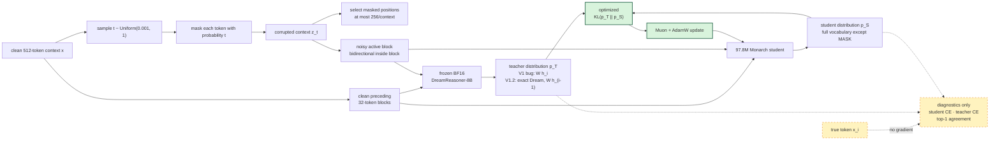
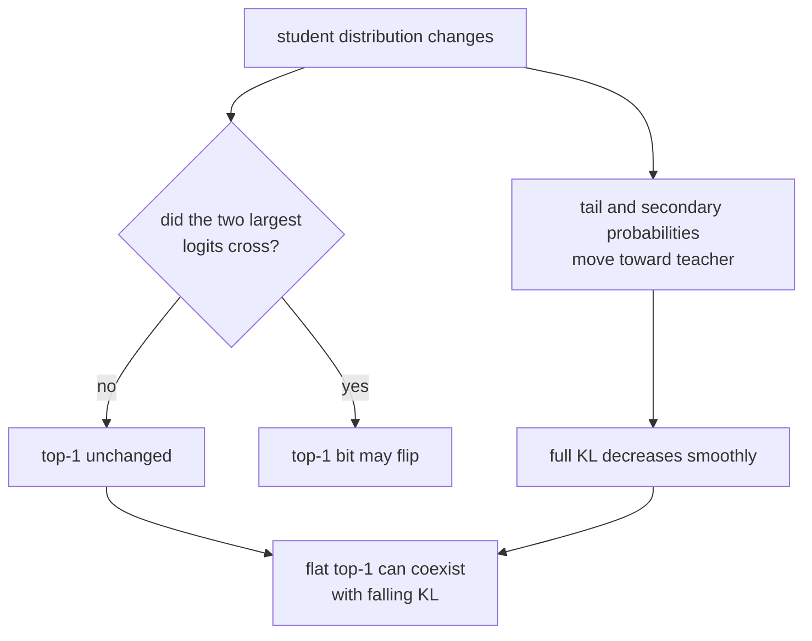

# V3 loss, diffusion schedule, and metric plateau

**Run:** [V3 eight-H100 quality run](https://wandb.ai/lev-tear-tear-labs/v3-dllm-monarch/runs/hyvnmuzo)

**Run candidate:** `V3-DLLM-MONARCH-97M-v1` (teacher alignment invalid)

**Completed predecessor:** `V3-DLLM-MONARCH-97M-v1.2`

**Current candidate:** `V3-DLLM-MONARCH-96M-deep-v2.1-posttrain`

**Completed raw-corpus systems run:** [44-layer FineWeb run](https://wandb.ai/lev-tear-tear-labs/v3-dllm-monarch/runs/furcfgms)

**Active post-training quality run:** [Tulu assistant-only b96×4](https://wandb.ai/lev-tear-tear-labs/v3-dllm-monarch/runs/f9061fos)

**Purpose:** explain exactly what the current run optimized, why its metrics
looked anomalous, and how the corrected next-run teacher adapter differs.

## Live status and architecture decision (2026-08-07)

The FineWeb run is not post-training quality evidence. It completed and remains
untouched, but the current candidate uses only pinned Tulu 3 instruction
conversations matched by the existing source allowlist. Dream's pinned
`chat_template.jinja` renders each conversation; only final assistant-response
content tokens are eligible for corruption and KL. Prompt, system, chat
separator, EOS, and every disallowed-source token are excluded.

The audited cache has 54,554 packed 512-token contexts (27,931,648 raw tokens)
and 5,145,336 assistant-eligible tokens. Its fixed disjoint-ID holdout has 128
contexts and 19,970 eligible tokens. This changes no parameter or loss math.
At the measured 18.42% response-token fraction, b80 across eight GPUs is
expected to select only about 30k tokens per microbatch; four accumulation
passes are therefore required for the 100k-token update target. The measured
b96 preflight selected 136,442 tokens/update at 74.03 GiB; b104 and b112 OOMed.
Fresh heldout KL improved consecutively
`9.35919 -> 9.27838 -> 9.19818 -> 9.14629` through update three, passing the
two-improvement gate. Student CE reached 11.74944. Teacher CE is 6.01161 with
23.99% hard-token accuracy under the fixed diffusion corruptions; this is not
clean autoregressive next-token CE. Checkpoint 3 restored under the same W&B
run, which is continuing to a finite step-100 cap with eval/save every ten
updates.

The current executable student is width 128 and depth 44, with four query
heads, two KV heads, 32 dimensions per head, 32-token blocks, Monarch expansion
3, and exactly 95,572,992 trainable parameters. It runs on all eight H100s at
80 contexts/GPU with no gradient accumulation: 640 contexts and 327,680 raw
corpus tokens per update. Actual selected diffusion targets are roughly
107,000--132,000 per update because corruption is sampled and supervision is
capped at 256 masked positions/context.

The schedule is constant from update one: dense Muon LR `0.02`, batched
Monarch Muon LR `0.02`, and fused AdamW LR `3e-4`. There is no warmup or decay
in the current quality leg. All three routed learning rates, exact forward KL,
selected tokens, and update time are logged to the current direct W&B run:
[deep-v2-quality-b80-r1](https://wandb.ai/lev-tear-tear-labs/v3-dllm-monarch/runs/furcfgms).

The requested 4x-depth/half-width candidate is now the current architecture.
Its audited routes are 222 ordinary Muon tensors / 6,881,280 parameters, 264
batched-Monarch-Muon tensors / 69,206,016 parameters, and 136 fused-AdamW
tensors / 19,485,696 parameters. True-eager b160, b144, b128, b112, and b96
all OOMed near the 79.18 GiB device limit. b80 passed at 71.69 GiB and 20,933
selected tokens/s, beating b64's 19,852 selected tokens/s; it is therefore the
largest and highest-throughput stable physical batch.

On the new fixed holdout, full KL improved consecutively
`8.47427 -> 8.11967 -> 7.86257 -> 7.34615 -> 4.97529` at steps 0, 5, 10, 20,
and 90. Student CE improved from `11.95449` to `8.41819`, while teacher CE
stayed exactly `5.87777`. Checkpoint 10 was restored with the full composite
optimizer/scheduler/RNG state, and resumed checkpoints 70/80/90 exist. The run
continues to the finite step-300 endpoint under the same W&B ID.

The step-50 continuation also exposed that the former streaming “fixed” eval
was neither fixed nor 128 examples after distributed sharding: Trainer reported
16 examples and its reconstructed step-50 KL changed. Those values are now
invalid as longitudinal evidence, although the training loss and gradients are
unaffected. The corrected path materializes 128 contexts from a pinned
FineWeb-Edu Parquet shard disjoint from the training shard, records their token
digest, and evaluates the map-style set with zero subprocess workers. This also
removes 64 persistent streaming workers that currently consume CPU between
updates. The live run is not being interrupted while its finite KL continues
to learn; the fixed set starts a new held-out baseline at the next run boundary.

The same continuation exposed a separate launch bug: supplying non-null
TorchInductor backend/mode fields makes Transformers enable compilation even
when the CLI flag is false. Variable selected-row shapes then caused eight
whole-model recompilations. After Dynamo exhausted that limit and fell back to
eager, update time dropped from 57--70 seconds to 6.9--9.4 seconds. A live trace
showed all eight H100s at 99--100% SM activity; update 110 processed 222,840
selected tokens in 7.37 seconds. At diagnostic update 111, training full KL was
3.8895, student CE 7.4695, teacher agreement 17.35%, and student hard-token
accuracy 6.89%, so top-1 is not plateaued. Backend/mode are now passed only
when `--compile` is explicit, with a runtime assertion on the resulting
TrainingArguments state.

## Executive summary

The V1 student is trained on block-diffusion-corrupted text, but its
optimization loss is **teacher-only, temperature-1 forward KL**. Student
hard-label CE, teacher CE, and student/teacher top-1 agreement are logged only;
they do not contribute gradients.

At the last inspected held-out points, full KL had fallen from approximately
`6.60` to `1.45`, while student/teacher top-1 agreement stayed near `32%`.
That is mathematically possible because KL compares the complete probability
distribution over 151,935 non-mask vocabulary entries. Top-1 changes only when
two student logits cross.

The teacher hard-label CE near `10.1` led to a source audit that found the root
cause: Dream's pretrained convention is right-shifted. dLLM's Dream trainer,
sampler, and evaluator all score logical token `i` using raw Dream logits from
position `i-1`. V1 projected hidden state `h[i]`, which is aligned to the next
token. A subsequent V1.1 preflight exposed a second incompatibility: dLLM's
copied Dream model class added 108 random Q/K/V bias tensors and discarded 72
learned Q/K norm tensors from this checkpoint. V1.2 minimally corrects dLLM's
Dream attention and requires an exact state-dict load. The checkpoint is a
diffusion model; the V1 teacher alignment and V1.1 loader were wrong.
Consequently, V1 is valid systems evidence but not valid Dream-distillation or
quality evidence.

The corrected V1.2 quality run resolves the anomalous numbers directly. Its
fixed held-out teacher CE is 5.7186, teacher hard-token top-1 accuracy is
18.95%, and teacher mean top-1 probability is 39.92%. Through step 10,
held-out KL improved monotonically at every evaluation from 8.7698 to 7.6143,
student CE improved 11.9805 to 10.8114, agreement reached 8.02%, and student
hard-token accuracy reached 3.92%. The run restored its complete step-2
checkpoint, wrote checkpoint 10 after 2,001,928 supervised tokens, and is now
continuing from it under the same W&B ID with a finite step-50 cap.

## Confirmed V1/V1.1 adapter bugs and V1.2 correction

dLLM declares `right_shift_logits=True` for Dream and evaluates it with

$$
\widetilde\ell_{:,0}=\ell_{:,0},\qquad
\widetilde\ell_{:,i}=\ell_{:,i-1}\quad(i>0).
$$

V1 instead used

$$
p_{T,\mathrm{V1}}^i=\operatorname{softmax}(W_T h_i^T),
$$

so its “teacher CE” measured the wrong token alignment. V1.1 uses

$$
\boxed{
p_{T,\mathrm{V1.1}}^i=\operatorname{softmax}(W_T h_{i-1}^T),\quad i>0
}
$$

and never corrupts or supervises position zero. At a 32-token boundary, raw
Dream query 31 predicts logical token 32; the corrected teacher-only attention
mask therefore assigns raw query 31 to logical block 1. This lets it attend the
noisy active block 1 and clean prior block 0. The student remains same-position
aligned and its mask does not change.

V1.2 keeps dLLM's pinned `DreamModel` and Transformers 4.57 environment. Its
bootstrap changes only checkpoint-defined attention behavior: Q/K/V projections
use `config.attention_bias`, and learned per-head Q/K RMSNorm is applied before
RoPE. dLLM's thin generation wrapper cannot return Transformers' loading-info
tuple, so the adapter calls the maintained base `PreTrainedModel` loader with
the dLLM class. Startup fails unless it reports zero missing, unexpected,
mismatched, or errored weights. The exact audited teacher contains
8,190,735,360 frozen BF16 parameters.

## Visual explainer

The active block is dense/bidirectional internally. Information crosses blocks
only from clean preceding blocks to the active block, so future blocks cannot
leak into a prediction.

## Corruption schedule

For each clean context \(x\), the trainer samples one time

$$
t\sim\mathcal U(\epsilon,1),\qquad \epsilon=10^{-3}.
$$

dLLM's default linear alpha schedule is

$$
\alpha(t)=1-t.
$$

Therefore each maskable token is independently replaced by `[MASK]` with

$$
P(z_i=[MASK]\mid x_i,t)=1-\alpha(t)=t.
$$

The realized masked fraction in each 32-token block is passed to the student's
AdaLN noise conditioner. Supervision is calculated only at masked positions,
with at most 256 selected positions per context.

The cap changes the effective distribution of supervised positions. Ignoring
small binomial fluctuations, a context contributes

$$
n(t)\approx\min(512t,256)
$$

selected positions. Consequently, if metrics and loss are averaged over
selected positions, their approximate mean supervised timestep is

$$
\mathbb E[t\mid\text{selected}]
=
\frac{\int_0^{1/2}512t^2\,dt+\int_{1/2}^{1}256t\,dt}
     {\int_0^{1/2}512t\,dt+\int_{1/2}^{1}256\,dt}
=\frac{11}{18}\approx0.611.
$$

Thus the typical supervised token comes from a context that is roughly 61%
masked, rather than the 50% suggested by the unweighted mean of \(t\).

## Exact implemented V3 loss

Let \(S\) be the selected masked positions. At position \(i\), temperature is
one and the mask-token row is removed before softmax:

$$
p_T^i(v)=\operatorname{softmax}(\ell_T^i)_v,
\qquad
p_S^i(v)=\operatorname{softmax}(\ell_S^i)_v,
\qquad v\in\mathcal V\setminus\{[MASK]\}.
$$

The current objective is

$$
\boxed{
\mathcal L_{\mathrm{V3}}
=\frac{1}{|S|}\sum_{i\in S}
D_{\mathrm{KL}}\!\left(p_T^i\Vert p_S^i\right)
}
$$

or

$$
\mathcal L_{\mathrm{V3}}
=\frac{1}{|S|}\sum_{i\in S}\sum_{v\ne[MASK]}
p_T^i(v)\log\frac{p_T^i(v)}{p_S^i(v)}.
$$

Because the teacher is frozen,

$$
D_{\mathrm{KL}}(p_T\Vert p_S)
=-\sum_v p_T(v)\log p_S(v)-H(p_T),
$$

so minimizing forward KL is equivalent to minimizing cross-entropy with the
teacher's complete soft distribution. Its student-logit derivative is

$$
\boxed{
\frac{\partial\mathcal L}{\partial\ell_S^i(v)}
=\frac{p_S^i(v)-p_T^i(v)}{|S|}
}.
$$

The implementation uses Liger's fused linear generalized-JSD kernel with
`jsd_beta=0.0` and `temperature=1.0`. In Liger, the first distribution is the
student \(Q\), the second is teacher \(P\), and beta zero is explicitly the
forward direction \(D_{KL}(P\Vert Q)\). The KL direction was correct in V1;
the teacher logits supplied to it were positionally misaligned. V1.1 corrects
the selected teacher hidden state before applying the same loss.

### What is not in the gradient

| Quantity | Formula | Optimized? |
|---|---|---:|
| Full forward KL | \(D_{KL}(p_T\Vert p_S)\) | **yes** |
| Student hard CE | \(-\log p_S(x_i)\) | no; diagnostic |
| Teacher hard CE | \(-\log p_T(x_i)\) | no; diagnostic |
| Top-1 agreement | \(\mathbf{1}[\arg\max p_S=\arg\max p_T]\) | no; diagnostic |
| Student/teacher hard-token accuracy | \(\mathbf{1}[\arg\max p=x_i]\) | diagnostic |
| Standard diffusion \(1/t\) weight | \(-\alpha'(t)/(1-\alpha(t))\) | no |

Labels are passed to the fused kernel only as the ignore-position mask. Every
position reaching the kernel is already a selected, valid masked position;
there is no hidden hard-label CE term.

## Why top-1 can flatline while KL falls

Top-1 agreement is

$$
A=\frac1{|S|}\sum_{i\in S}
\mathbf{1}\!\left[
\arg\max_v p_S^i(v)=\arg\max_v p_T^i(v)
\right].
$$

It is discontinuous and has zero gradient almost everywhere. Consider

$$
p_T=(0.40,0.39,0.21),\qquad
p_S=(0.39,0.40,0.21).
$$

These distributions have KL of only about \(2.5\times10^{-4}\), but their
top-1 predictions still disagree. The agreement bit does not flip until the
student's first two logits cross.

With 151,935 non-mask vocabulary entries, the student can reduce KL by
correcting probability mass across thousands of non-winning tokens while the
argmax remains unchanged. Consequently:

The observed pattern therefore does not, by itself, indicate a reversed KL or
a broken backward pass.

## What the V1 teacher CE actually means

Teacher CE near `10.1` implies geometric-mean true-token probability

$$
\exp(-10.1)\approx4.1\times10^{-5}.
$$

Uniform probability over 151,935 classes has

$$
-\log(1/151935)=\log(151935)\approx11.93.
$$

The numerical statement “1.8 nats better than uniform” is correct for the
distribution V1 actually projected, and student CE near `8.75` corresponds to
\(\exp(-8.75)\approx1.6\times10^{-4}\). But those numbers do **not** establish
that Dream is a weak teacher: V1 compared the true token with Dream's
wrong-position distribution.

This also explains why the student could have lower hard CE while forward KL
fell. It was learning a neighboring-token soft distribution through shared
language structure, not the intended Dream denoising distribution. Pure forward
KL would indeed fail to preserve a genuine student hard-CE advantage, but the
V1 comparison cannot tell us whether such an advantage exists after alignment
is corrected.

The high-noise cap bias, block-causal distribution shift, and 97.8M-versus-8B
capacity gap remain valid questions for V1.1. They must be measured after the
right-shift correction rather than inferred from V1's invalid CE.

## Paper diffusion loss versus the V3 distillation loss

The Rao-Blackwellized masked-diffusion objective used by MDLM is a weighted
mixture of masked-language-model losses:

$$
\mathcal L_{\mathrm{diff}}
=\mathbb E_{t,z_t}
\left[
\frac{-\alpha'(t)}{1-\alpha(t)}
\sum_{i:z_i=[MASK]}
-\log p_\theta(x_i\mid z_t,t)
\right].
$$

For the linear schedule \(\alpha(t)=1-t\),

$$
\frac{-\alpha'(t)}{1-\alpha(t)}=\frac1t.
$$

Block Diffusion applies this denoising likelihood blockwise, conditioning block
\(b\) on clean prior blocks \(x_{<b}\):

$$
\mathcal L_{\mathrm{BD3}}
\propto
\sum_b\mathbb E_{t,z_t^b}
\left[
\frac1t\sum_{i\in b:z_i=[MASK]}
-\log p_\theta(x_i\mid z_t^b,x_{<b},t)
\right].
$$

V3 uses the paper's corruption process and block-causal conditioning, but not
this hard-label likelihood objective. It instead trains only
\(D_{KL}(p_T\Vert p_S)\), without \(1/t\) weighting. This was the requested
simple initial distillation objective, but it should not be confused with the
diffusion NELBO.

One possible next objective, if diagnostics justify it, is a diffusion-weighted
combination:

$$
\mathcal L_{\mathrm{next}}
=(1-\lambda)\mathcal L_{\mathrm{hard,diff}}
+\lambda\mathcal L_{\mathrm{KD,diff}},
$$

where both the hard-token CE and teacher KL use the appropriate time and
subsampling weights. This is a proposal only, not the current architecture or
current run.

## Current optimization schedule

| Route | Optimizer | Learning rate | Schedule |
|---|---|---:|---|
| Ordinary 2D body weights | native PyTorch Muon | `0.02` | constant |
| Monarch factor slices | BatchedMonarchMuon | `0.02` | constant |
| Embedding/head, norms, biases, AdaLN | fused AdamW | `3e-4` | constant |

There is no warmup or decay. The `warmup_supervised_tokens` and
`schedule_supervised_tokens` values in `CONFIG.py` are currently inert. W&B's
generic `learning_rate` field reports only the first optimizer route (`0.02`),
not the AdamW learning rate.

The current deep-v2 run uses 80 contexts/GPU on eight GPUs, or 640
contexts/update with no gradient accumulation. The first finite leg evaluated
the fixed 128-context holdout at initialization and steps 5/10, wrote full
checkpoints 5/10, and resumed from checkpoint 10 under the same W&B run. The
continuation evaluates and checkpoints every ten updates. All three route
learning rates are logged explicitly.

## Evidence before changing the loss

V1.2 now tests right-shifted selected projection and positions 31/32, logs both
hard-token accuracies, agreement, teacher confidence/entropy, all three route
learning rates, and selected timestep/mask fraction. Held-out corruption and
capped-position selection are deterministic. dLLM's unused NaN NLL/PPL callback
has been removed. The remaining useful diagnostic is KL/CE stratified into
timestep or realized-mask-fraction bins rather than only their selected-token
means.

Decision rule:

- If teacher hard accuracy and CE are reasonable at low noise but collapse at
  high noise, fix the time/subsampling weighting.
- If the teacher is poor even at low noise, revisit the Dream block-causal
  adapter before trusting KL targets.
- If the teacher is good across noise but student KL alone plateaus, test a
  decaying LR and quantify the 97.8M student's capacity floor.
- Add hard-label diffusion CE only as a separately identified candidate after
  these measurements; do not silently mutate results attached to V1.

## References

- Sahoo et al., [*Simple and Effective Masked Diffusion Language Models*](https://arxiv.org/abs/2406.07524), NeurIPS 2024.
- Arriola et al., [*Block Diffusion: Interpolating Between Autoregressive and Diffusion Language Models*](https://arxiv.org/abs/2503.09573), ICLR 2025.
- Hinton, Vinyals, and Dean, [*Distilling the Knowledge in a Neural Network*](https://arxiv.org/abs/1503.02531), 2015.
- Pinned dLLM [`MDLMTrainer`](https://raw.githubusercontent.com/ZHZisZZ/dllm/ca176752fbceec49c6b4777a2c18ae88e4eb10ed/dllm/core/trainers/mdlm.py) and [`BD3LMTrainer`](https://raw.githubusercontent.com/ZHZisZZ/dllm/ca176752fbceec49c6b4777a2c18ae88e4eb10ed/dllm/core/trainers/bd3lm.py).
- Liger Kernel v0.8.1 [`jsd.py`](https://raw.githubusercontent.com/linkedin/Liger-Kernel/v0.8.1/src/liger_kernel/ops/jsd.py), including the beta-zero forward-KL implementation.
